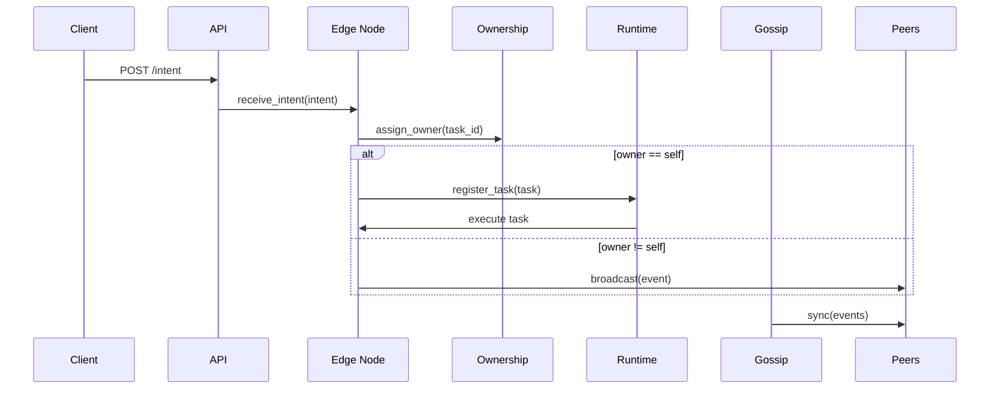

# Artifact Edge v3

A distributed edge computing framework for multi-node task orchestration with guaranteed single execution, event persistence, and eventual consistency.

## Overview

Artifact Edge v3 enables reliable task execution across a network of edge nodes. Tasks (called "intents") are submitted to any node, but only the designated owner node executes them, ensuring no duplicate execution. The system uses distributed consensus via consistent hashing, event sourcing for durability, and gossip protocols for synchronization.

### Key Features

- **Single Execution Guarantee**: Each task executes exactly once across the network
- **Distributed Ownership**: Consistent hashing assigns task ownership without central coordination
- **Event Sourcing**: All operations are stored as immutable events in SQLite
- **Eventual Consistency**: Gossip protocol synchronizes events across all nodes
- **Fault Tolerance**: Network partitions and node failures don't break task guarantees
- **Extensible Agents**: Pluggable task handlers for custom operations
- **REST API**: Simple HTTP interface for task submission and monitoring

## Architecture
The following diagrams show the high-level architecture and the intent flow.

```mermaid
graph LR
  Client[Client]
  API[Flask API]
  Node1[Edge Node 1\n(Port 5001)]
  Node2[Edge Node 2\n(Port 5002)]
  DB1[(SQLite DB)]
  DB2[(SQLite DB)]
  Runtime1[Runtime]
  Runtime2[Runtime]

  Client -->|POST /intent| API
  API --> Node1
  API --> Node2
  Node1 ---|gossip sync| Node2
  Node1 -->|persist| DB1
  Node2 -->|persist| DB2
  Node1 --> Runtime1
  Node2 --> Runtime2
```



## Speciofication

This section explains how Artifact Edge works, the responsibilities of each major component, and the key guarantees the system provides.

- **Purpose:** Artifact Edge is a lightweight distributed execution fabric for edge nodes. Clients submit "intents" (tasks) to any node; the system ensures exactly-one execution of each intent across the network, durable event persistence, and eventual consistency.

- **Major components and roles:**
  - **EdgeNode (`node/edge_node.py`)**: Orchestrates local processing. Receives local intents via `receive_intent`, creates canonical events, persists them, assigns ownership, executes owned tasks, and broadcasts events to peers.
  - **Runtime (`core/runtime.py`)**: Background task loop that executes registered task objects (agents).
  - **EventLog (`core/event_log.py`)**: In-memory ordered list of events. Supports appending new local events and appending incoming canonical events (`append_event`) while preventing duplicates.
  - **SQLiteStore (`storage/sqlite_store.py`)**: Durable persistence of events. Provides `save_event` and `has_event` to avoid re-processing the same event.
  - **Ownership (`core/ownership.py`)**: Deterministic owner selection using consistent hashing of the task id. Ensures only the chosen owner executes a task.
  - **VectorClock (`core/vector_clock.py`)**: Tracks causal information used for merging and basic ordering across nodes.
  - **MeshNetwork (`mesh/network.py`)**: Lightweight peer-to-peer transport used for broadcasting canonical events; incoming messages are delivered to `EdgeNode.receive_event` (not re-interpreted as new intents).
  - **Gossip (`mesh/gossip.py`)**: Periodically pushes local events to peers via HTTP `/sync` to achieve eventual consistency.
  - **IntentHandler / Agents (`protocols/intent.py`, `agents/`)**: Maps an intent payload to a task object (e.g., `MoveTask`) that implements `execute()`.

- **Event lifecycle / data flow:**
  1. Client submits an intent (HTTP or programmatic) to a node.
  2. Node creates a canonical event (unique `id`, `timestamp`, `payload`, `clock`) and appends it locally.
  3. Node persists the event via `SQLiteStore.save_event`.
  4. Node assigns ownership using `Ownership.assign_owner(task_id, peers)`.
  5. If this node is the owner, it registers the task with the `Runtime` for execution; otherwise it broadcasts the canonical event to peers.
  6. Peers receive canonical events and call `receive_event(event)`. Each peer checks `SQLiteStore.has_event(id)` and skips if already seen. If unseen, peer appends and persists the event and executes it if it is the owner.

- **Guarantees and safety measures:**
  - **Single execution (best-effort):** Deterministic ownership ensures ideally one node registers the task for execution. Durable IDs plus `save_event` with `INSERT OR IGNORE` and `has_event` prevents re-execution across gossip/broadcast loops.
  - **Durability:** Events are persisted immediately to SQLite before ownership decisions are acted on.
  - **Eventual consistency:** Gossip synchronizes events across nodes; clocks are merged to preserve causal information.

- **Known limitations & failure modes:**
  - The demo uses plain TCP sockets and unauthenticated HTTP for gossip; production deployments should use authenticated channels and TLS.
  - Ownership is computed from the task id and peer list; rapid membership churn can cause temporary ownership changes.
  - This implementation is a minimal demo—there is no leader election, partition healing logic beyond event sync, or strong consensus.

- **Scaling and deployment notes:**
  - The system is designed to scale by adding nodes; ownership spreads deterministically via hashing.
  - For production, replace the simple `MeshNetwork` with a robust transport (TLS, connection pools), and use a resilient storage and replication layer if SQLite is insufficient.

- **Demo and observability:**
  - Use `scripts/demo.py` for a quick in-process demo. Each node writes a local `node-<id>.db` SQLite file (ignored by `.gitignore`).
  - Logs printed to stdout show ownership decisions and agent execution. Inspect the SQLite DB to confirm persisted events.


### Core Components

- **Edge Node** (`node/edge_node.py`): Main orchestrator receiving intents and managing execution
- **Runtime** (`core/runtime.py`): Background task execution loop
- **Event Log** (`core/event_log.py`): In-memory event tracking with persistence
- **Ownership** (`core/ownership.py`): Distributed leadership using consistent hashing
- **Vector Clock** (`core/vector_clock.py`): Causal ordering of events
- **Mesh Network** (`mesh/network.py`): Peer-to-peer communication
- **Gossip Protocol** (`mesh/gossip.py`): Event synchronization
- **Intent Protocol** (`protocols/intent.py`): Task routing and execution
- **REST API** (`api/control_api.py`): HTTP endpoints for clients

## Installation

### Prerequisites

- Python 3.8+
- pip

### Setup

```bash
# Clone the repository
git clone <repository-url>
cd artifact-edge-v3-1

# Install dependencies
pip install flask requests
```

## Usage

### Demo (Investor-friendly)

We provide a small, reproducible demo that starts three in-process nodes, wires peers, sends intents, and prints a concise summary. This is ideal for a quick investor demo or local showcase.

Run the demo:

```bash
python scripts/demo.py
```

What the demo does:
- Starts three Edge Nodes (ports 5001, 5002, 5003)
- Wires peers so broadcast/gossip works
- Submits two `move` intents and waits for propagation
- Prints each node's in-memory event log and SQLite event counts

Sample trimmed output (your run will show timestamps and generated IDs):

```
[demo] Sending intent to node-1
[node-1] EXECUTING <task-id>
[Agent] Moving toward Warehouse A
--- node-1 event log (N) ---
{... event entries ...}
node-1 DB events: N
```

### Starting Individual Nodes (interactive)

Note: `EdgeNode` instances are configured programmatically in this project. To start an individual node interactively, run a short Python snippet. The repository includes `scripts/demo.py` for an automated demo.

Example (interactive):

```bash
python -c "from node.edge_node import EdgeNode; n=EdgeNode('node-1',5001); n.mesh.start(); n.runtime.start();"
```

### Single-node local web profile (PC/Mac + mobile)

Run one local node with built-in web UI and API:

```bash
python api/control_api.py
```

Then open:
- `http://localhost:8000/` on desktop (PC/Mac) or phone/tablet browser.
- `http://localhost:8000/setup` for setup-first flow.

For authenticated write operations outside AP onboarding/recovery modes, set:

```bash
export EDGE_SESSION_TOKEN=edge-local-dev
```

and pass it as `X-EDGE-SESSION` header (the bundled UI sends this token automatically).

### ESP32-S3 onboarding profile (AP + USB bootstrap)

- First boot / recovery: device remains in AP onboarding state and exposes setup URL from `/bootstrap/usb`.
- USB after flashing: plug the device in, open setup URL, configure SSID/password, backend endpoint, and LLM provider settings.
- Deterministic state progression:
  - `ap_onboarding` -> `sta_connecting` (after saving Wi-Fi credentials)
  - `sta_connecting` -> `backend_ready` (after STA join/back-end reachability)
  - Any link loss can move node into `recovery_ap`

Troubleshooting:
- Wrong SSID/password: send `recover_ap` connectivity event or restart in recovery mode, then re-enter credentials.
- Unreachable backend or LLM base URL: verify `/health` + `/connectivity`, then update `/config`.
- LLM URL validation:
  - OpenAI-compatible requires a URL path containing `/v1`.
  - Anthropic-compatible requires an Anthropic host domain.

### Submitting Tasks

Use curl or any HTTP client to submit intents to the REST API (when `api/control_api.py` is running):

```bash
# Submit a move task
curl -X POST http://localhost:8000/intent \
  -H "Content-Type: application/json" \
  -d '{"type": "move", "target": "Warehouse A"}'
```

### API Endpoints

- `POST /intent` - Submit a new task intent
  - Body: `{"type": "task_type", "data": {...}}`
  - Returns: Task acceptance confirmation

- `POST /sync` - Receive gossip synchronization events
  - Body: List of events to sync
  - Returns: Sync acknowledgment

## Task Types

The framework supports extensible task agents. Built-in agents:

- **Move Agent** (`agents/move_agent.py`): Handles movement intents
  - Input: `{"type": "move", "data": {"direction": "north|south|east|west", "distance": number}}`

Add custom agents by implementing the agent interface and registering with the IntentHandler.

## Configuration

Nodes are configured programmatically:

```python
node = EdgeNode(
    node_id='unique_node_id',
    port=5001,
    peers=[('peer1_host', peer1_port), ('peer2_host', peer2_port)]
)
```

## Development

### Project Structure

```
artifact-edge-v3-1/
├── agents/           # Task execution agents
├── api/             # REST API endpoints
├── core/            # Core runtime components
├── docs/            # Documentation
├── mesh/            # Networking and gossip
├── node/            # Main edge node implementation
├── protocols/       # Intent and event protocols
├── simulation/      # Test simulations
└── storage/         # Persistent storage backends
```

### Adding New Agents

1. Create a new agent class in `agents/`
2. Implement the `execute` method
3. Register the agent in `protocols/intent.py`

Example:

```python
class CustomAgent:
    def execute(self, intent_data):
        # Your task logic here
        pass
```

### Testing
 
Run the project's unit tests and demo checks:

```bash
pytest -q
python scripts/demo.py
python simulation/stress_swarm.py --nodes 5 --intents 500
```

Expected behavior: intents are accepted, events are persisted to each node's SQLite DB, and only the ownership-determined node executes a given intent.

### Swarm and stress validation

- `simulation/swarm_framework.py` provides a configurable in-repo swarm harness.
- `tests/test_swarm.py` validates single execution and eventual consistency under partition/heal.
- `simulation/stress_swarm.py` runs adversarial scenarios (duplicates, drops, delay, partition/heal) and prints pass/fail metrics.

### Inter-node communication profiles

- `lan` profile: local socket transport for low-latency networks.
- `lora` profile: ESP32-S3 + LoRa bridge profile with bounded frame fragmentation.
- Deep-space requirements and operational guidance are documented in:
  - `docs/communications_spec.md`
  - `docs/acceptance_criteria.md`

## Contributing

1. Fork the repository
2. Create a feature branch
3. Make your changes
4. Add tests if applicable
5. Submit a pull request

## License

MIT License - see LICENSE file for details.

## Support

For questions or issues, please open a GitHub issue.