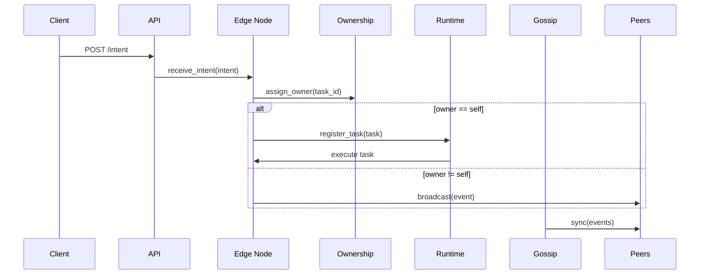

# Artifact Edge v3

A distributed edge computing framework for multi-node task orchestration with guaranteed single execution, event persistence, and eventual consistency.

## Overview

Artifact Edge v3 enables reliable task execution across a network of edge nodes. Tasks (called "intents") are submitted to any node, but only the designated owner node executes them, ensuring no duplicate execution. The system uses distributed consensus via consistent hashing, event sourcing for durability, and gossip protocols for synchronization.

### Key Features

- **Single Execution Guarantee**: Each task executes exactly once across the network
- **Distributed Ownership**: Consistent hashing assigns task ownership without central coordination
- **Event Sourcing**: All operations are stored as immutable events in SQLite
- **Eventual Consistency**: Gossip protocol synchronizes events across all nodes
- **Fault Tolerance**: Network partitions and node failures don't break task guarantees
- **Extensible Agents**: Pluggable task handlers for custom operations
- **REST API**: Simple HTTP interface for task submission and monitoring

## Architecture
The following diagrams show the high-level architecture and the intent flow.

```mermaid
graph LR
  Client[Client]
  API[Flask API]
  Node1[Edge Node 1\n(Port 5001)]
  Node2[Edge Node 2\n(Port 5002)]
  DB1[(SQLite DB)]
  DB2[(SQLite DB)]
  Runtime1[Runtime]
  Runtime2[Runtime]

  Client -->|POST /intent| API
  API --> Node1
  API --> Node2
  Node1 ---|gossip sync| Node2
  Node1 -->|persist| DB1
  Node2 -->|persist| DB2
  Node1 --> Runtime1
  Node2 --> Runtime2
```



### Core Components

- **Edge Node** (`node/edge_node.py`): Main orchestrator receiving intents and managing execution
- **Runtime** (`core/runtime.py`): Background task execution loop
- **Event Log** (`core/event_log.py`): In-memory event tracking with persistence
- **Ownership** (`core/ownership.py`): Distributed leadership using consistent hashing
- **Vector Clock** (`core/vector_clock.py`): Causal ordering of events
- **Mesh Network** (`mesh/network.py`): Peer-to-peer communication
- **Gossip Protocol** (`mesh/gossip.py`): Event synchronization
- **Intent Protocol** (`protocols/intent.py`): Task routing and execution
- **REST API** (`api/control_api.py`): HTTP endpoints for clients

## Installation

### Prerequisites

- Python 3.8+
- pip

### Setup

```bash
# Clone the repository
git clone <repository-url>
cd artifact-edge-v3-1

# Install dependencies
pip install flask requests
```

## Usage

### Demo (Investor-friendly)

We provide a small, reproducible demo that starts three in-process nodes, wires peers, sends intents, and prints a concise summary. This is ideal for a quick investor demo or local showcase.

Run the demo:

```bash
python scripts/demo.py
```

What the demo does:
- Starts three Edge Nodes (ports 5001, 5002, 5003)
- Wires peers so broadcast/gossip works
- Submits two `move` intents and waits for propagation
- Prints each node's in-memory event log and SQLite event counts

Sample trimmed output (your run will show timestamps and generated IDs):

```
[demo] Sending intent to node-1
[node-1] EXECUTING <task-id>
[Agent] Moving toward Warehouse A
--- node-1 event log (N) ---
{... event entries ...}
node-1 DB events: N
```

### Starting Individual Nodes (interactive)

Note: `EdgeNode` instances are configured programmatically in this project. To start an individual node interactively, run a short Python snippet. The repository includes `scripts/demo.py` for an automated demo.

Example (interactive):

```bash
python -c "from node.edge_node import EdgeNode; n=EdgeNode('node-1',5001); n.mesh.start(); n.runtime.start();"
```

### Submitting Tasks

Use curl or any HTTP client to submit intents to the REST API (when `api/control_api.py` is running):

```bash
# Submit a move task
curl -X POST http://localhost:8000/intent \
  -H "Content-Type: application/json" \
  -d '{"type": "move", "target": "Warehouse A"}'
```

### API Endpoints

- `POST /intent` - Submit a new task intent
  - Body: `{"type": "task_type", "data": {...}}`
  - Returns: Task acceptance confirmation

- `POST /sync` - Receive gossip synchronization events
  - Body: List of events to sync
  - Returns: Sync acknowledgment

## Task Types

The framework supports extensible task agents. Built-in agents:

- **Move Agent** (`agents/move_agent.py`): Handles movement intents
  - Input: `{"type": "move", "data": {"direction": "north|south|east|west", "distance": number}}`

Add custom agents by implementing the agent interface and registering with the IntentHandler.

## Configuration

Nodes are configured programmatically:

```python
node = EdgeNode(
    node_id='unique_node_id',
    port=5001,
    peers=[('peer1_host', peer1_port), ('peer2_host', peer2_port)]
)
```

## Development

### Project Structure

```
artifact-edge-v3-1/
├── agents/           # Task execution agents
├── api/             # REST API endpoints
├── core/            # Core runtime components
├── docs/            # Documentation
├── mesh/            # Networking and gossip
├── node/            # Main edge node implementation
├── protocols/       # Intent and event protocols
├── simulation/      # Test simulations
└── storage/         # Persistent storage backends
```

### Adding New Agents

1. Create a new agent class in `agents/`
2. Implement the `execute` method
3. Register the agent in `protocols/intent.py`

Example:

```python
class CustomAgent:
    def execute(self, intent_data):
        # Your task logic here
        pass
```

### Testing

Run the project's unit tests and demo checks:

```bash
pytest -q
python scripts/demo.py
```

Expected behavior: intents are accepted, events are persisted to each node's SQLite DB, and only the ownership-determined node executes a given intent.

## Contributing

1. Fork the repository
2. Create a feature branch
3. Make your changes
4. Add tests if applicable
5. Submit a pull request

## License

MIT License - see LICENSE file for details.

## Support

For questions or issues, please open a GitHub issue.