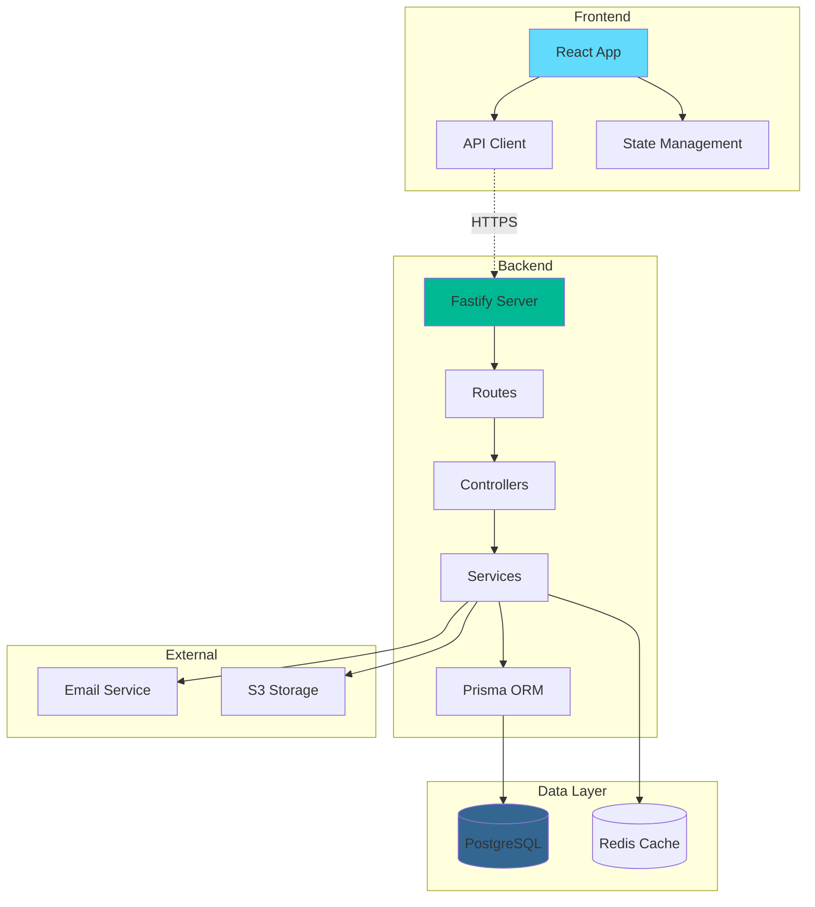

# GitHub Copilot Skills & Abilities

**Version:** 2.1.0  
**Last Updated:** February 2026  
**Classification:** Internal - Confidential  
**Purpose:** Comprehensive skill set for AI-assisted enterprise development

---

> **Note:** Code examples throughout this document use various tech stacks
> (Fastify, Prisma, React, etc.) for illustration purposes. This repository's
> actual stack is Python, JSON file-based databases, HTML/CSS/JS, and Bash.
> See `copilot/TOOLS.md` § "This Repository's Actual Stack" for specifics.

## Table of Contents

1. [Context Management](#context-management)
2. [Code Generation](#code-generation)
3. [Testing & Quality Assurance](#testing--quality-assurance)
4. [Security & Compliance](#security--compliance)
5. [Documentation](#documentation)
6. [DevOps & Infrastructure](#devops--infrastructure)
7. [Data Engineering](#data-engineering)
8. [Architecture & Design](#architecture--design)
9. [Troubleshooting & Debugging](#troubleshooting--debugging)
10. [Advanced Capabilities](#advanced-capabilities)

---

## Context Management

### Skill: Session Initialization with Context Loading

**Description:** Automatically load and parse context.json at the start of each session to understand current system state.

**Implementation:**
```javascript
// Auto-execute at session start
async function loadContext() {
  const context = JSON.parse(fs.readFileSync('copilot/context.json', 'utf8'));
  
  // Display summary
  console.log(`🏢 Organization: ${context.organization.name}`);
  console.log(`📊 Overall Health: ${context.health.overall}`);
  console.log(`🚀 Active Projects: ${Object.keys(context.projects).length}`);
  
  // Check for blockers
  if (context.blockers && context.blockers.length > 0) {
    console.log(`⚠️  Blockers: ${context.blockers.length}`);
    context.blockers.forEach(b => console.log(`  - ${b.id}: ${b.description}`));
  }
  
  return context;
}
```

**Triggers:**
- New session started
- User types "load context" or "refresh context"
- Before suggesting changes to monitored components

### Skill: Session Handoff Generator

**Description:** Generate comprehensive handoff notes when approaching token limits.

**Implementation:**
```markdown
## Session Handoff Generator

**When to use:** Token usage > 90% or manual trigger

**Generated format:**
---
## Session Handoff: [TIMESTAMP]

### Context Reference
- Last context.json update: [timestamp]
- Working directory: [current path]
- Git branch: [branch name]
- Files modified: [list]

### Completed Tasks
[x] Task with specifics and file references
[x] Another task with outcome

### In-Progress Work
[ ] Partially complete task (XX% done)
    - What's done: [details]
    - What remains: [details]
    - Next steps: [ordered list]
    - Files: [paths and line numbers]

### Decisions Made
- Decision 1: Rationale and implications
- Decision 2: Alternative considered and why rejected

### Blockers & Warnings
⚠️ Blocker: Description with context
💡 Note: Important consideration for next session

### Recommended Next Steps
1. High priority task with specific approach
2. Medium priority task
3. Low priority cleanup task

### Context Preservation
```json
{
  "resumeFrom": "file.ts:123",
  "approach": "description",
  "testStatus": "passing/failing",
  "dependencies": ["list"]
}
```
---
```

**Output Location:** `copilot/copilot-conversations/Handoff_[TIMESTAMP].md`

### Skill: Context-Aware Code Suggestions

**Description:** Suggest code that aligns with current project standards from context.json.

**Example:**
```typescript
// Context: Fastify 5.7, TypeScript 5.5, Prisma 7.3
// Generate endpoint matching project standards

import { FastifyInstance, FastifyReply, FastifyRequest } from 'fastify';
import { z } from 'zod';

// Schema validation (from context: using Zod)
const createUserSchema = z.object({
  email: z.string().email(),
  name: z.string().min(2),
  role: z.enum(['user', 'admin'])
});

export default async function userRoutes(fastify: FastifyInstance) {
  // POST /api/users - Create user (following context API structure)
  fastify.post('/api/users', {
    schema: {
      body: {
        type: 'object',
        required: ['email', 'name'],
        properties: {
          email: { type: 'string', format: 'email' },
          name: { type: 'string', minLength: 2 },
          role: { type: 'string', enum: ['user', 'admin'] }
        }
      }
    }
  }, async (request: FastifyRequest, reply: FastifyReply) => {
    try {
      const data = createUserSchema.parse(request.body);
      
      // Using Prisma (from context)
      const user = await fastify.prisma.user.create({
        data: {
          ...data,
          createdAt: new Date()
        }
      });
      
      // Audit logging (context requirement)
      await fastify.auditLog.create({
        action: 'USER_CREATE',
        userId: request.user?.id,
        resourceId: user.id,
        timestamp: new Date()
      });
      
      return reply.code(201).send(user);
    } catch (error) {
      fastify.log.error('Failed to create user', error);
      return reply.code(400).send({ error: 'Invalid request' });
    }
  });
}
```

---

## Code Generation

### Skill: Full-Stack Feature Scaffolding

**Description:** Generate complete feature with frontend, backend, database, and tests.

**Trigger:** User requests "create feature [name]" or "scaffold [feature]"

**Generated Components:**

1. **Database Schema** (Prisma)
```prisma
model Feature {
  id        String   @id @default(cuid())
  name      String
  status    String   @default("active")
  createdAt DateTime @default(now())
  updatedAt DateTime @updatedAt
  userId    String
  user      User     @relation(fields: [userId], references: [id])
}
```

2. **Backend API** (Fastify + TypeScript)
- CRUD endpoints with validation
- Error handling with typed exceptions
- Audit logging
- Rate limiting
- OpenAPI documentation

3. **Frontend Component** (React + TypeScript)
- Form with validation
- State management (Zustand)
- Data fetching (React Query)
- Error boundaries
- Loading states

4. **Tests**
- Unit tests (Vitest/Jest)
- Integration tests (Supertest)
- E2E tests (Playwright)
- 80%+ coverage

5. **Documentation**
- README with usage examples
- API documentation
- Architecture diagram

### Skill: Type-Safe API Client Generation

**Description:** Generate fully typed API client from backend routes.

**Input:** Backend route definitions
**Output:** TypeScript client with types

```typescript
// Generated from backend routes
export class APIClient {
  constructor(private baseURL: string, private token?: string) {}
  
  // Auto-generated from POST /api/users endpoint
  async createUser(data: CreateUserRequest): Promise<User> {
    const response = await fetch(`${this.baseURL}/api/users`, {
      method: 'POST',
      headers: {
        'Content-Type': 'application/json',
        ...(this.token && { 'Authorization': `Bearer ${this.token}` })
      },
      body: JSON.stringify(data)
    });
    
    if (!response.ok) {
      throw new APIError(response.status, await response.json());
    }
    
    return response.json();
  }
  
  // ... other methods
}

// Type definitions extracted from schemas
export interface CreateUserRequest {
  email: string;
  name: string;
  role?: 'user' | 'admin';
}

export interface User {
  id: string;
  email: string;
  name: string;
  role: string;
  createdAt: string;
  updatedAt: string;
}
```

### Skill: Database Migration Generator

**Description:** Generate safe database migrations from schema changes.

**Capabilities:**
- Detect schema changes
- Generate up/down migrations
- Handle data preservation
- Validate migration safety
- Include rollback procedures

```typescript
// Migration: add_user_preferences
export async function up(prisma: PrismaClient) {
  // Create new table
  await prisma.$executeRaw`
    CREATE TABLE "UserPreferences" (
      "id" TEXT PRIMARY KEY,
      "userId" TEXT NOT NULL UNIQUE,
      "theme" TEXT DEFAULT 'light',
      "language" TEXT DEFAULT 'en',
      "createdAt" TIMESTAMP DEFAULT NOW(),
      FOREIGN KEY ("userId") REFERENCES "User"("id") ON DELETE CASCADE
    )
  `;
  
  // Create default preferences for existing users
  await prisma.$executeRaw`
    INSERT INTO "UserPreferences" ("id", "userId", "createdAt")
    SELECT gen_random_uuid(), "id", NOW()
    FROM "User"
  `;
}

export async function down(prisma: PrismaClient) {
  await prisma.$executeRaw`DROP TABLE "UserPreferences"`;
}
```

---

## Testing & Quality Assurance

### Skill: Comprehensive Test Suite Generation

**Description:** Generate complete test coverage for functions, components, and APIs.

**Unit Test Example:**
```typescript
import { describe, it, expect, beforeEach, vi } from 'vitest';
import { authenticateUser } from './auth';

describe('authenticateUser', () => {
  beforeEach(() => {
    vi.clearAllMocks();
  });
  
  it('should authenticate valid user with correct token', async () => {
    const token = 'valid.jwt.token';
    const mockUser = {
      id: '1',
      email: 'test@example.com',
      active: true,
      roles: ['user']
    };
    
    vi.mocked(verifyJWT).mockResolvedValue({ userId: '1' });
    vi.mocked(db.user.findUnique).mockResolvedValue(mockUser);
    
    const result = await authenticateUser(token);
    
    expect(result).toEqual(mockUser);
    expect(verifyJWT).toHaveBeenCalledWith(token);
  });
  
  it('should throw AuthenticationError for invalid token', async () => {
    vi.mocked(verifyJWT).mockRejectedValue(new Error('Invalid token'));
    
    await expect(authenticateUser('invalid.token'))
      .rejects.toThrow(AuthenticationError);
  });
  
  it('should throw for inactive user', async () => {
    vi.mocked(verifyJWT).mockResolvedValue({ userId: '1' });
    vi.mocked(db.user.findUnique).mockResolvedValue({
      id: '1',
      active: false
    });
    
    await expect(authenticateUser('token'))
      .rejects.toThrow('User not found or inactive');
  });
  
  it('should create audit log entry on successful auth', async () => {
    const mockUser = { id: '1', active: true };
    vi.mocked(verifyJWT).mockResolvedValue({ userId: '1' });
    vi.mocked(db.user.findUnique).mockResolvedValue(mockUser);
    
    await authenticateUser('token');
    
    expect(auditLog.create).toHaveBeenCalledWith(
      expect.objectContaining({
        action: 'USER_AUTH',
        userId: '1'
      })
    );
  });
});
```

### Skill: Integration Test Generator

**Description:** Generate API integration tests with realistic scenarios.

```typescript
import { describe, it, expect, beforeAll, afterAll } from 'vitest';
import { build } from './app';
import { FastifyInstance } from 'fastify';

describe('User API Integration', () => {
  let app: FastifyInstance;
  let authToken: string;
  
  beforeAll(async () => {
    app = await build({ logger: false });
    await app.ready();
    
    // Get auth token
    const response = await app.inject({
      method: 'POST',
      url: '/api/auth/login',
      payload: { email: 'test@example.com', password: 'password' }
    });
    authToken = JSON.parse(response.body).token;
  });
  
  afterAll(async () => {
    await app.close();
  });
  
  describe('POST /api/users', () => {
    it('should create user with valid data', async () => {
      const response = await app.inject({
        method: 'POST',
        url: '/api/users',
        headers: { authorization: `Bearer ${authToken}` },
        payload: {
          email: 'newuser@example.com',
          name: 'New User'
        }
      });
      
      expect(response.statusCode).toBe(201);
      const user = JSON.parse(response.body);
      expect(user).toMatchObject({
        email: 'newuser@example.com',
        name: 'New User'
      });
      expect(user.id).toBeDefined();
    });
    
    it('should return 400 for invalid email', async () => {
      const response = await app.inject({
        method: 'POST',
        url: '/api/users',
        headers: { authorization: `Bearer ${authToken}` },
        payload: {
          email: 'invalid-email',
          name: 'User'
        }
      });
      
      expect(response.statusCode).toBe(400);
    });
    
    it('should return 401 without auth token', async () => {
      const response = await app.inject({
        method: 'POST',
        url: '/api/users',
        payload: { email: 'test@example.com', name: 'Test' }
      });
      
      expect(response.statusCode).toBe(401);
    });
  });
});
```

### Skill: Test Coverage Gap Analyzer

**Description:** Identify untested code paths and generate missing tests.

**Analysis Output:**
```markdown
## Test Coverage Analysis

### Summary
- Overall Coverage: 76% (Target: 80%)
- Lines: 1,234 / 1,623
- Branches: 456 / 612 (74%)
- Functions: 89 / 95 (94%)

### Gaps Identified

#### auth.ts (65% coverage)
- Line 45-52: Error handling path not tested
- Line 78: Edge case for expired token
- Line 92-98: Audit log failure handling

**Generated Tests:**
[Test code for missing coverage]

#### database.ts (71% coverage)
- Line 123-130: Connection retry logic
- Line 156: Timeout handling

**Generated Tests:**
[Test code for missing coverage]
```

---

## Security & Compliance

### Skill: Security Vulnerability Scanner

**Description:** Scan code for common security vulnerabilities and suggest fixes.

**Detects:**
- SQL Injection vulnerabilities
- XSS vulnerabilities
- CSRF token absence
- Insecure cryptographic operations
- Hardcoded secrets
- Missing authentication checks
- Improper input validation
- Insecure dependencies

**Example Detection:**
```typescript
// ❌ VULNERABILITY DETECTED: SQL Injection
const query = `SELECT * FROM users WHERE id = ${userId}`;

// ✅ SUGGESTED FIX: Parameterized query
const query = 'SELECT * FROM users WHERE id = $1';
const result = await db.query(query, [userId]);

// Alternative with Prisma (preferred from context)
const user = await prisma.user.findUnique({
  where: { id: userId }
});
```

### Skill: OWASP Top 10 Compliance Checker

**Description:** Validate code against OWASP Top 10 security standards.

**Checks:**
1. **A01: Broken Access Control**
   - Verify RBAC implementation
   - Check authorization on all endpoints
   
2. **A02: Cryptographic Failures**
   - Validate encryption algorithms
   - Check for plaintext password storage
   
3. **A03: Injection**
   - SQL, NoSQL, Command injection checks
   - Input sanitization validation
   
4. **A04: Insecure Design**
   - Threat model review
   - Security requirements verification
   
5. **A05: Security Misconfiguration**
   - Check default credentials
   - Validate security headers
   
6. **A06: Vulnerable Components**
   - Dependency vulnerability scan
   - Version check against CVE database
   
7. **A07: Authentication Failures**
   - Password policy enforcement
   - Session management validation
   
8. **A08: Software and Data Integrity**
   - Code signing verification
   - Update mechanism security
   
9. **A09: Logging and Monitoring**
   - Audit log completeness
   - Monitoring coverage check
   
10. **A10: SSRF**
    - URL validation
    - Whitelist verification

### Skill: GRC Compliance Validator

**Description:** Ensure code changes maintain 36.5% GRC readiness.

**Validation:**
```typescript
async function validateGRCCompliance(changes: CodeChange[]): Promise<Report> {
  const checks = {
    auditLogging: checkAuditLogging(changes),
    encryption: checkEncryption(changes),
    accessControl: checkAccessControl(changes),
    dataProtection: checkDataProtection(changes),
    incidentResponse: checkIncidentResponse(changes)
  };
  
  const results = await Promise.all(Object.values(checks));
  
  return {
    compliant: results.every(r => r.passed),
    details: results,
    recommendations: generateRecommendations(results)
  };
}
```

---

## Documentation

### Skill: API Documentation Generator

**Description:** Auto-generate OpenAPI/Swagger documentation from route definitions.

**Output Example:**
```yaml
openapi: 3.0.0
info:
  title: Artifact Virtual API
  version: 1.0.0
  description: Enterprise API for Artifact Virtual platform

paths:
  /api/users:
    post:
      summary: Create new user
      tags:
        - Users
      security:
        - bearerAuth: []
      requestBody:
        required: true
        content:
          application/json:
            schema:
              $ref: '#/components/schemas/CreateUserRequest'
      responses:
        '201':
          description: User created successfully
          content:
            application/json:
              schema:
                $ref: '#/components/schemas/User'
        '400':
          description: Invalid request
        '401':
          description: Unauthorized

components:
  schemas:
    CreateUserRequest:
      type: object
      required:
        - email
        - name
      properties:
        email:
          type: string
          format: email
        name:
          type: string
          minLength: 2
        role:
          type: string
          enum: [user, admin]
  
  securitySchemes:
    bearerAuth:
      type: http
      scheme: bearer
      bearerFormat: JWT
```

### Skill: Mermaid Diagram Generator

**Description:** Generate architecture diagrams from code structure.

**Example:**


### Skill: JSDoc/TSDoc Generator

**Description:** Generate comprehensive documentation comments for functions and classes.

**Generated Output:**
```typescript
/**
 * Authenticates a user using JWT token and returns user data with permissions.
 * 
 * This function verifies the JWT token, fetches the user from the database,
 * validates user status, and creates an audit log entry.
 * 
 * @param token - JWT token string from Authorization header
 * 
 * @returns Promise resolving to User object with roles and permissions
 * 
 * @throws {AuthenticationError} When token is invalid, expired, or user is inactive
 * @throws {DatabaseError} When database query fails
 * 
 * @example
 * ```typescript
 * const user = await authenticateUser(req.headers.authorization);
 * console.log(`Authenticated: ${user.email}`);
 * ```
 * 
 * @since 1.0.0
 * @see {@link verifyJWT} for token verification logic
 * @see {@link auditLog} for audit logging implementation
 * 
 * @security Requires valid JWT token
 * @performance O(1) database lookup with indexed user ID
 */
async function authenticateUser(token: string): Promise<UserWithPermissions> {
  // Implementation...
}
```

---

## DevOps & Infrastructure

### Skill: GitHub Actions Workflow Generator

**Description:** Generate CI/CD workflows for testing, building, and deployment.

**Example Workflow:**
```yaml
name: CI/CD Pipeline

on:
  push:
    branches: [main, develop]
  pull_request:
    branches: [main]

jobs:
  test:
    runs-on: ubuntu-latest
    steps:
      - uses: actions/checkout@v4
      
      - name: Setup Node.js
        uses: actions/setup-node@v4
        with:
          node-version: '18'
          cache: 'npm'
      
      - name: Install dependencies
        run: npm ci
      
      - name: Run linter
        run: npm run lint
      
      - name: Type check
        run: npm run type-check
      
      - name: Run tests
        run: npm test -- --coverage
      
      - name: Upload coverage
        uses: codecov/codecov-action@v3
        with:
          files: ./coverage/lcov.info
  
  security:
    runs-on: ubuntu-latest
    steps:
      - uses: actions/checkout@v4
      
      - name: Run CodeQL
        uses: github/codeql-action/analyze@v2
      
      - name: Security audit
        run: npm audit --audit-level=moderate
  
  build:
    needs: [test, security]
    runs-on: ubuntu-latest
    steps:
      - uses: actions/checkout@v4
      
      - name: Build application
        run: npm run build
      
      - name: Upload artifacts
        uses: actions/upload-artifact@v3
        with:
          name: build
          path: dist/
  
  deploy:
    needs: build
    if: github.ref == 'refs/heads/main'
    runs-on: ubuntu-latest
    steps:
      - name: Deploy to production
        run: echo "Deploy to Vercel/AWS/etc"
```

### Skill: Docker Configuration Generator

**Description:** Generate Dockerfile and docker-compose.yml for applications.

**Dockerfile:**
```dockerfile
# Multi-stage build for optimized image
FROM node:18-alpine AS builder

WORKDIR /app

# Copy dependency files
COPY package*.json ./
COPY tsconfig.json ./

# Install dependencies
RUN npm ci --only=production

# Copy source code
COPY src/ ./src/

# Build application
RUN npm run build

# Production stage
FROM node:18-alpine

WORKDIR /app

# Copy built files and dependencies
COPY --from=builder /app/dist ./dist
COPY --from=builder /app/node_modules ./node_modules
COPY --from=builder /app/package.json ./

# Create non-root user
RUN addgroup -g 1001 -S nodejs && \
    adduser -S nodejs -u 1001

USER nodejs

EXPOSE 3000

CMD ["node", "dist/index.js"]
```

**docker-compose.yml:**
```yaml
version: '3.8'

services:
  app:
    build: .
    ports:
      - "3000:3000"
    environment:
      - NODE_ENV=production
      - DATABASE_URL=postgresql://postgres:password@db:5432/app
      - REDIS_URL=redis://redis:6379
    depends_on:
      - db
      - redis
    restart: unless-stopped
    networks:
      - app-network

  db:
    image: postgres:14-alpine
    environment:
      - POSTGRES_PASSWORD=password
      - POSTGRES_DB=app
    volumes:
      - postgres-data:/var/lib/postgresql/data
    networks:
      - app-network
    restart: unless-stopped

  redis:
    image: redis:7-alpine
    volumes:
      - redis-data:/data
    networks:
      - app-network
    restart: unless-stopped

volumes:
  postgres-data:
  redis-data:

networks:
  app-network:
    driver: bridge
```

### Skill: Infrastructure as Code Generator

**Description:** Generate Terraform/CloudFormation for infrastructure provisioning.

---

## Data Engineering

### Skill: Database Query Optimizer

**Description:** Analyze and optimize slow database queries.

**Optimization Example:**
```typescript
// ❌ SLOW: N+1 query problem
async function getUsersWithPosts() {
  const users = await prisma.user.findMany();
  for (const user of users) {
    user.posts = await prisma.post.findMany({
      where: { authorId: user.id }
    });
  }
  return users;
}

// ✅ OPTIMIZED: Single query with join
async function getUsersWithPosts() {
  return prisma.user.findMany({
    include: {
      posts: {
        select: {
          id: true,
          title: true,
          createdAt: true
        }
      }
    }
  });
}

// ✅ FURTHER OPTIMIZED: With pagination and filtering
async function getUsersWithPosts(page: number = 1, limit: number = 50) {
  return prisma.user.findMany({
    take: limit,
    skip: (page - 1) * limit,
    where: {
      active: true,
      posts: {
        some: {}  // Only users with posts
      }
    },
    include: {
      posts: {
        take: 10,  // Limit posts per user
        orderBy: { createdAt: 'desc' },
        select: {
          id: true,
          title: true,
          createdAt: true
        }
      }
    }
  });
}
```

### Skill: ETL Pipeline Generator

**Description:** Generate data transformation and loading pipelines.

---

## Architecture & Design

### Skill: System Architecture Analyzer

**Description:** Analyze codebase and generate architecture documentation.

**Generated Analysis:**
```markdown
# System Architecture Analysis

## Overview
- **Architecture Pattern:** Microservices with API Gateway
- **Communication:** REST + WebSocket
- **Data Storage:** PostgreSQL (primary) + Redis (cache)
- **Authentication:** JWT with refresh tokens

## Component Diagram

\`\`\`mermaid
graph TB
    subgraph "Client Layer"
        A[Web App]
        B[Mobile App]
    end
    
    subgraph "API Gateway"
        C[Nginx]
        D[Rate Limiting]
    end
    
    subgraph "Application Layer"
        E[Auth Service]
        F[User Service]
        G[Business Logic]
    end
    
    subgraph "Data Layer"
        H[(PostgreSQL)]
        I[(Redis)]
    end
    
    A --> C
    B --> C
    C --> D
    D --> E
    D --> F
    D --> G
    E --> H
    F --> H
    G --> H
    E --> I
    F --> I
\`\`\`

## Design Patterns Used
- **Repository Pattern:** Data access abstraction
- **Factory Pattern:** Object creation
- **Strategy Pattern:** Algorithm selection
- **Observer Pattern:** Event handling
- **Decorator Pattern:** Feature enhancement

## Dependencies
- **External Services:** 12
- **Internal Services:** 5
- **Third-party Libraries:** 127

## Recommendations
1. Consider implementing Circuit Breaker for external service calls
2. Add caching layer for frequently accessed data
3. Implement database connection pooling
4. Add monitoring and observability
```

### Skill: Design Pattern Suggester

**Description:** Suggest appropriate design patterns for code refactoring.

---

## Troubleshooting & Debugging

### Skill: Error Pattern Analyzer

**Description:** Analyze error logs and identify patterns.

**Analysis Output:**
```markdown
## Error Pattern Analysis

### Summary
- Total Errors: 1,247
- Unique Error Types: 23
- Time Range: Last 7 days

### Top Errors

#### 1. Database Connection Timeout (42%)
**Frequency:** 524 occurrences  
**Pattern:** Peaks during 2-4 PM UTC  
**Affected Services:** User Service, Auth Service  
**Root Cause:** Connection pool exhausted  
**Recommendation:** Increase pool size from 10 to 25

#### 2. JWT Token Expired (28%)
**Frequency:** 349 occurrences  
**Pattern:** Random throughout day  
**Affected Services:** All services  
**Root Cause:** Client not refreshing tokens  
**Recommendation:** Implement automatic token refresh

#### 3. Rate Limit Exceeded (18%)
**Frequency:** 224 occurrences  
**Pattern:** Burst traffic from specific IPs  
**Affected Services:** API Gateway  
**Root Cause:** Missing per-user rate limiting  
**Recommendation:** Add user-based rate limiting

### Recommended Fixes

\`\`\`typescript
// Fix 1: Increase connection pool
const prisma = new PrismaClient({
  datasources: {
    db: {
      url: process.env.DATABASE_URL
    }
  },
  pool: {
    max: 25,  // Increased from 10
    min: 5,
    acquireTimeout: 30000
  }
});

// Fix 2: Auto token refresh
async function refreshTokenIfNeeded(token: string): Promise<string> {
  const decoded = jwt.decode(token);
  const expiresIn = decoded.exp - Date.now() / 1000;
  
  if (expiresIn < 300) {  // Refresh if < 5 minutes
    return await refreshToken(token);
  }
  
  return token;
}

// Fix 3: User-based rate limiting
fastify.register(rateLimit, {
  max: 100,
  timeWindow: '1 minute',
  keyGenerator: (request) => request.user?.id || request.ip
});
\`\`\`
```

### Skill: Performance Profiler

**Description:** Identify performance bottlenecks and suggest optimizations.

---

## Advanced Capabilities

### Skill: Code Migration Assistant

**Description:** Assist in migrating code between frameworks or versions.

**Example: Express → Fastify Migration**
```typescript
// Before (Express)
app.post('/api/users', async (req, res) => {
  try {
    const user = await createUser(req.body);
    res.status(201).json(user);
  } catch (error) {
    res.status(500).json({ error: error.message });
  }
});

// After (Fastify) - Auto-generated
fastify.post('/api/users', {
  schema: {
    body: {
      type: 'object',
      required: ['email', 'name'],
      properties: {
        email: { type: 'string', format: 'email' },
        name: { type: 'string' }
      }
    },
    response: {
      201: {
        type: 'object',
        properties: {
          id: { type: 'string' },
          email: { type: 'string' },
          name: { type: 'string' }
        }
      }
    }
  }
}, async (request: FastifyRequest, reply: FastifyReply) => {
  try {
    const user = await createUser(request.body);
    return reply.code(201).send(user);
  } catch (error) {
    request.log.error(error);
    throw new InternalServerError(error.message);
  }
});
```

### Skill: Dependency Upgrade Manager

**Description:** Analyze and perform safe dependency upgrades.

**Process:**
1. Analyze current dependencies
2. Check for available updates
3. Review breaking changes
4. Generate migration guide
5. Update package.json
6. Run tests to verify
7. Update lock files

### Skill: Refactoring Assistant

**Description:** Suggest and perform code refactorings to improve quality.

**Refactoring Types:**
- Extract Method/Function
- Extract Class/Module
- Rename Symbol
- Move Function
- Inline Variable
- Remove Dead Code
- Simplify Conditional Logic

### Skill: AI-Powered Code Review

**Description:** Perform comprehensive code review with actionable feedback.

**Review Categories:**
- Code Style & Conventions
- Performance Issues
- Security Vulnerabilities
- Best Practice Violations
- Test Coverage Gaps
- Documentation Quality

---

## Skill Activation

All skills are **active by default** and can be triggered:

1. **Automatically:** Based on file types and patterns
2. **On Demand:** User types specific commands
3. **Contextually:** Based on context.json state
4. **Proactively:** Based on code analysis

---

## Version History

### 2.0.0 (2026-02-07)
- Complete rewrite with 2026 best practices
- Added context management skills
- Added session handoff capability
- Added all advanced skills
- Integrated with context.json

---

**Note:** This skills catalog is continuously expanding. New capabilities are added as AI technology advances and enterprise needs evolve.
