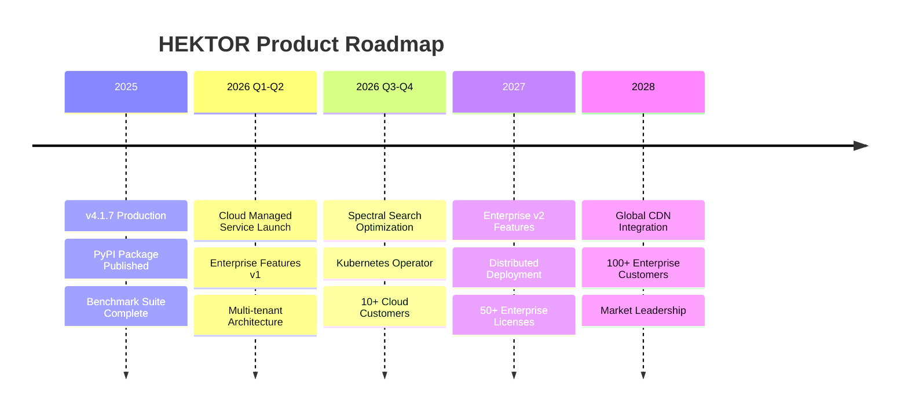
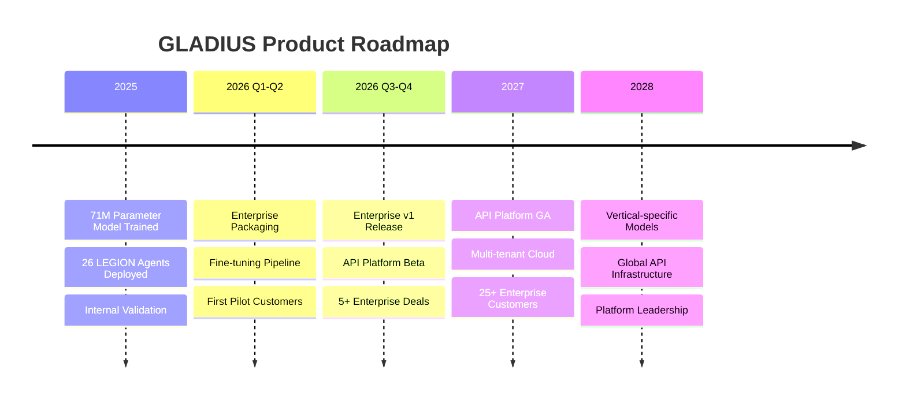
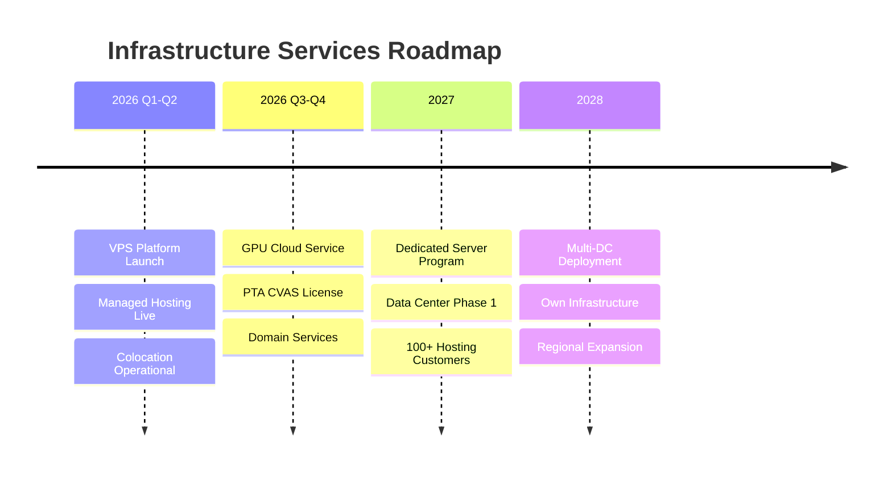
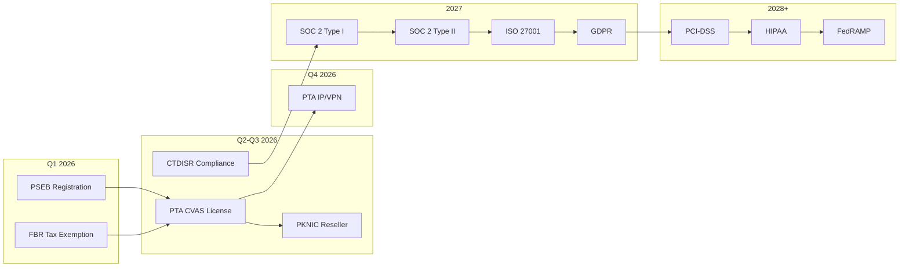
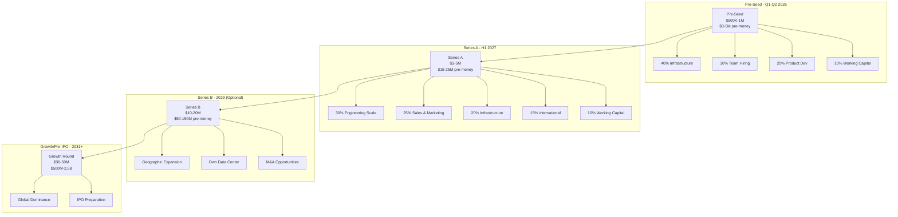
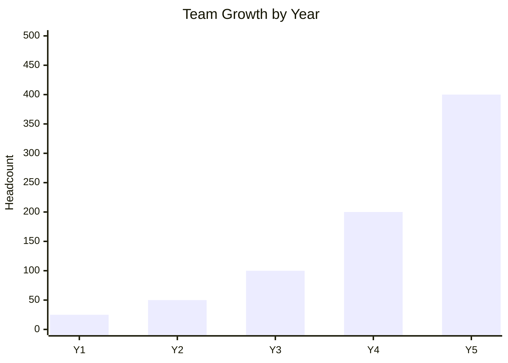
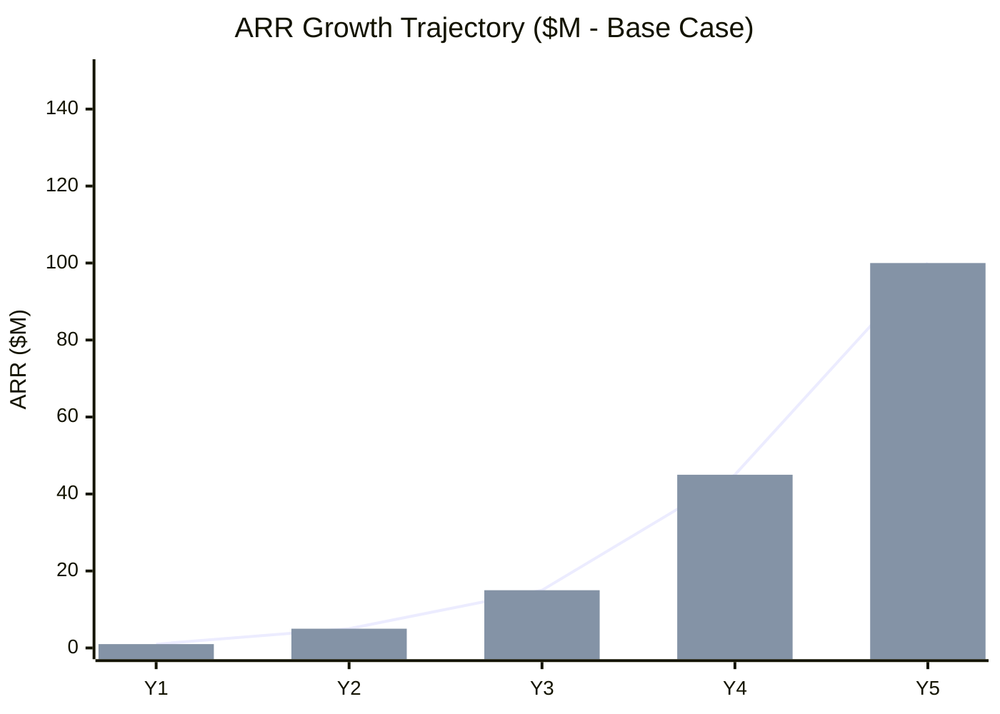

# Strategic Roadmap

**Artifact Virtual (SMC-Private) Limited**  
**Classification:** Confidential - Investor Relations  
**Version:** 1.0.0  
**Date:** February 10, 2026

---

## Executive Summary

This roadmap consolidates Artifact Virtual's strategic execution plan across eight growth phases, from company formation (2025) through market leadership and potential exit (2030+). The plan integrates product development, market expansion, regulatory compliance, funding milestones, and operational scaling into a unified timeline.

**Overall Progress:** 35% complete  
**Current Phase:** Phase 2-3 (Technology Development + Organizational Structure)  
**Next Major Milestone:** Pakistan Market Launch (Q2-Q3 2026)

---

## Phase Summary

| Phase | Description | Timeline | Status | Key Deliverables |
|-------|-------------|----------|--------|------------------|
| **0-1** | Company Formation | 2025 | ✅ Complete | SECP registration (#0325693), legal structure, founding team |
| **2** | Technology Development | 2025-2026 | 🔄 75% Complete | HEKTOR v4.1.7, GLADIUS platform, CTHULU v5.3.0, core tech stack |
| **3** | Organization & GRC | 2026 | 🔄 45% Complete | Org structure, 10/10 GRC controls, 52 security codes, PSEB/PTA in process |
| **4** | Pakistan Market Launch | Q2-Q3 2026 | ⏳ Pending | First 10 customers, VPS/hosting live, $50K+ MRR |
| **5** | US/EU Virtual Services | Q3-Q4 2026 | ⏳ Pending | Virtual US/EU presence, international customers, 25+ customers |
| **6** | Global SaaS Platform | 2027 | ⏳ Pending | Cloud platform, API services, 100+ customers, SOC 2, $500K MRR |
| **7** | Multi-Region Expansion | 2028-2029 | ⏳ Pending | Physical US/EU presence, owned data center, 200+ customers |
| **8** | Market Leadership / Exit | 2030+ | ⏳ Pending | $56.5M-250M ARR, IPO/acquisition readiness, 300-700 customers |

---

## Year 1 (2026) — Foundation & Launch

### Q1 2026: Pre-Seed & Infrastructure

| Category | Milestone | Target Date | Dependencies |
|----------|-----------|-------------|--------------|
| **Funding** | Pre-seed close ($500K-1M) | March 2026 | Investor term sheets |
| **Regulatory** | PSEB TechDestination registration | March 2026 | Company documentation |
| **Regulatory** | FBR IT export tax exemption filed | March 2026 | PSEB approval |
| **Team** | VP Engineering hired | March 2026 | Pre-seed funding |
| **Team** | Core engineering team (8-12) | Q1 2026 | Pre-seed funding |
| **Product** | HEKTOR PyPI stable release | Q1 2026 | Current progress |

### Q2 2026: Product Launch

| Category | Milestone | Target Date | Dependencies |
|----------|-----------|-------------|--------------|
| **Product** | HEKTOR Cloud launch (managed service) | June 2026 | Infrastructure setup |
| **Product** | VPS platform operational | May 2026 | PTA CVAS in process |
| **Regulatory** | PTA CVAS application submitted | April 2026 | PSEB complete |
| **Infrastructure** | Colocation lease signed (Islamabad) | May 2026 | Pre-seed funds |
| **Revenue** | First managed hosting customer | May 2026 | VPS platform |
| **Revenue** | $10K-20K MRR achieved | June 2026 | Product launches |

### Q3 2026: Market Traction

| Category | Milestone | Target Date | Dependencies |
|----------|-----------|-------------|--------------|
| **Product** | GLADIUS Enterprise v1 release | September 2026 | ML team capacity |
| **Regulatory** | PTA CVAS license approved | August 2026 | PTA review complete |
| **Regulatory** | PKNIC domain reseller accreditation | September 2026 | CVAS approved |
| **Revenue** | First 10 paying customers | September 2026 | Product-market fit |
| **Revenue** | $30K-50K MRR achieved | September 2026 | Customer growth |
| **Market** | US virtual services launch | Q3 2026 | Compliance framework |

### Q4 2026: Scale Preparation

| Category | Milestone | Target Date | Dependencies |
|----------|-----------|-------------|--------------|
| **Revenue** | $50K-80K MRR achieved | December 2026 | Customer expansion |
| **Product** | CTHULU institutional licensing program | Q4 2026 | Live trading validation |
| **Product** | Artifact ERP beta release | Q4 2026 | Core development |
| **Team** | 15-20 total employees | December 2026 | Revenue growth |
| **Regulatory** | PTA IP/VPN registration submitted | Q4 2026 | CVAS operational |
| **Infrastructure** | GPU cluster operational (first phase) | Q4 2026 | Hardware procurement |

### Year 1 Financial Targets

| Metric | Target Range | Notes |
|--------|-------------|-------|
| ARR | $600K-$1.5M | Multi-product revenue |
| MRR (Dec) | $50K-$125K | Exit rate for Series A |
| Customers | 10-25 | Paying enterprise + SMB |
| Gross Margin | 50-55% | Infrastructure-heavy year |
| Team Size | 15-20 | Engineering-focused |
| Cash Position | $300K-$800K | Runway to Series A |

---

## Year 2 (2027) — Growth & Series A

### Q1 2027: Series A Preparation

| Category | Milestone | Target Date | Dependencies |
|----------|-----------|-------------|--------------|
| **Revenue** | $100K+ MRR achieved | January 2027 | Growth trajectory |
| **Regulatory** | SOC 2 Type I certification | March 2027 | Audit preparation |
| **Product** | HEKTOR Enterprise v2 features | Q1 2027 | Customer feedback |
| **Product** | GLADIUS API platform beta | Q1 2027 | Enterprise demand |
| **Funding** | Series A process initiated | February 2027 | $100K+ MRR validation |
| **Market** | EU virtual services launch | Q1 2027 | GDPR framework |

### Q2 2027: Series A Close

| Category | Milestone | Target Date | Dependencies |
|----------|-----------|-------------|--------------|
| **Funding** | Series A close ($3-5M at $15-25M pre) | June 2027 | Due diligence complete |
| **Regulatory** | SOC 2 Type II certification | June 2027 | 6-month audit window |
| **Team** | 35-50 total employees | June 2027 | Series A capital |
| **Team** | US sales team (2-3 people) | June 2027 | Series A capital |
| **Infrastructure** | Data center buildout Phase 1 | Q2 2027 | Series A capital |
| **Revenue** | $150K-$250K MRR | June 2027 | Sales acceleration |

### Q3-Q4 2027: Scale Operations

| Category | Milestone | Target Date | Dependencies |
|----------|-----------|-------------|--------------|
| **Infrastructure** | First data center operational | September 2027 | Buildout complete |
| **Regulatory** | ISO 27001 certification | December 2027 | Audit process |
| **Regulatory** | GDPR compliance validated | Q4 2027 | EU operations |
| **Revenue** | $500K+ MRR achieved | December 2027 | Series B trigger |
| **Revenue** | 100+ paying customers | December 2027 | Market expansion |
| **Revenue** | US market revenue >25% | December 2027 | Geographic diversification |
| **Metric** | NRR >120% achieved | December 2027 | Expansion revenue |

### Year 2 Financial Targets

| Metric | Target Range | Notes |
|--------|-------------|-------|
| ARR | $2.5M-$7M | 300-400% growth |
| MRR (Dec) | $500K+ | Series B trigger |
| Customers | 50-100 | Enterprise + SMB mix |
| Gross Margin | 55-60% | Scale efficiencies |
| EBITDA | Break-even | Month 24-30 target |
| Team Size | 35-50 | Post-Series A growth |

---

## Year 3 (2028) — Expansion & Profitability

### Key Milestones

| Category | Milestone | Target Date | Dependencies |
|----------|-----------|-------------|--------------|
| **Revenue** | Break-even achieved | Q2 2028 | Cost optimization |
| **Revenue** | $1M+ MRR sustained | Q2 2028 | Growth momentum |
| **Infrastructure** | Multi-region infrastructure | Q3 2028 | Geographic expansion |
| **Market** | Dubai/Singapore regional office | Q2 2028 | International demand |
| **Product** | HEKTOR distributed deployment | Q3 2028 | Enterprise feature |
| **Product** | GLADIUS multi-tenant cloud | Q4 2028 | SaaS scale |
| **Team** | 65-90 total employees | December 2028 | Profitable growth |

### Year 3 Financial Targets

| Metric | Target Range | Notes |
|--------|-------------|-------|
| ARR | $8M-$25M | 200-250% growth |
| Customers | 100-200 | Enterprise focus |
| Gross Margin | 55-60% | Stable at scale |
| EBITDA Margin | 20-25% | Profitable operations |
| Team Size | 65-90 | Global distribution |

---

## Years 4-5 (2029-2030) — Market Leadership

### Year 4 (2029) Targets

| Category | Milestone | Notes |
|----------|-----------|-------|
| **Funding** | Series B (optional) $10-20M | Growth capital if needed |
| **Revenue** | $23M-$70M ARR | 180-200% growth |
| **Infrastructure** | Own data center (Islamabad) | Infrastructure independence |
| **Market** | 3+ international offices | Global footprint |
| **Team** | 130-170 employees | Global organization |
| **EBITDA Margin** | 25-30% | Strong profitability |

### Year 5 (2030) Targets

| Category | Milestone | Notes |
|----------|-----------|-------|
| **Revenue** | $56.5M-$250M ARR | Market leadership |
| **Customers** | 300-700 | Enterprise-heavy |
| **Gross Margin** | 55-60% | Sustained efficiency |
| **EBITDA Margin** | 25-35% | Industry-leading |
| **Team** | 255-500 | Global scale |
| **Exit Readiness** | IPO/acquisition ready | Multiple options |

---

## Product Roadmap

### HEKTOR (Vector Database) — Flagship

### GLADIUS (AI Platform) — Core Platform

### Infrastructure Services

---

## Regulatory & Compliance Roadmap

### Compliance Timeline Detail

| Certification | Target | Business Impact | Cost Estimate |
|--------------|--------|-----------------|---------------|
| **PSEB Registration** | Q1 2026 | IT export tax exemption (100%), credibility | PKR 5,000/yr ($18) |
| **PTA CVAS License** | Q2-Q3 2026 | Enables VPS/hosting/cloud services | PKR 100K-500K |
| **PTA IP/VPN** | Q4 2026 | Enterprise VPN services | PKR 200K-1M |
| **PKNIC Reseller** | Q3 2026 | .pk domain registration services | PKR 10K-50K |
| **SOC 2 Type I** | Q1 2027 | US enterprise sales enablement | $20K-50K |
| **SOC 2 Type II** | Q2 2027 | Enterprise procurement approval | $30K-75K |
| **ISO 27001** | Q4 2027 | EU enterprise requirement | $30K-100K |
| **GDPR Compliance** | Q4 2027 | EU market access | $20K-50K |

---

## Funding Roadmap

### Cap Table Evolution

| Stage | Founder | Pre-Seed | ESOP | Series A | Series B | Post-Money |
|-------|---------|----------|------|----------|----------|------------|
| **Formation** | 100% | — | — | — | — | — |
| **Post Pre-Seed** | 84.2% | 15.8% | — | — | — | $4.75M |
| **Post Series A** | 65.6% | 12.3% | 6.6% | 15.6% | — | $24M |
| **Post Series B** | 55.0% | 10.3% | 8.2% | 13.0% | 13.4% | $115M |

**Note:** Founder retains majority control through Series B.

---

## Team Scaling Roadmap

### Department Distribution

| Department | Y1 (2026) | Y2 (2027) | Y3 (2028) | Y5 (2030) |
|-----------|-----------|-----------|-----------|-----------|
| Engineering & R&D | 8-12 | 15-25 | 30-50 | 100-200 |
| ML / Data Science | 3-5 | 5-10 | 10-20 | 40-80 |
| Sales & Marketing | 3-5 | 8-15 | 15-30 | 50-100 |
| Operations & Infra | 3-5 | 5-10 | 10-20 | 40-80 |
| G&A | 2-3 | 4-6 | 8-12 | 25-40 |
| **Total** | **19-30** | **37-66** | **73-132** | **255-500** |

### Key Hires by Phase

| Phase | Critical Hires | Timeline |
|-------|---------------|----------|
| **Pre-Seed** | VP Engineering, ML Lead, DevOps Lead | Q1-Q2 2026 |
| **Post Pre-Seed** | Senior Engineers (4-6), Product Manager | Q2-Q4 2026 |
| **Pre Series A** | Sales Lead, Marketing Manager, 2nd ML Engineer | Q4 2026-Q1 2027 |
| **Post Series A** | US Sales (2-3), Engineering Managers, Security Lead | Q2-Q4 2027 |
| **Scale** | Regional Directors, VP Sales, CFO | 2028+ |

---

## Revenue Roadmap

### Revenue by Product Line (Year 5 Target)

| Product Line | Y1 | Y3 | Y5 | CAGR |
|-------------|-----|-----|-----|------|
| **HEKTOR** (Enterprise + Cloud) | $150K-400K | $3M-10M | $15M-60M | 150%+ |
| **GLADIUS** (Enterprise + API) | $100K-300K | $2M-8M | $10M-40M | 150%+ |
| **Infrastructure Services** | $200K-600K | $3M-10M | $20M-100M | 160%+ |
| **CTHULU** (Licensing + Fees) | $50K-150K | $500K-2M | $3M-15M | 140%+ |
| **Artifact ERP** | $0-50K | $500K-3M | $5M-25M | 200%+ |
| **Other (REASON, SENTINEL, etc.)** | $50K-100K | $1M-4M | $5M-20M | 150%+ |
| **Total** | **$600K-1.5M** | **$8M-25M** | **$56.5M-250M** | **155%+** |

### Key Revenue Milestones

| Milestone | Target | Trigger/Impact |
|-----------|--------|----------------|
| First paying customer | Q2 2026 | Product validation |
| $10K MRR | Q2 2026 | Early traction |
| $50K MRR | Q4 2026 | Product-market fit signal |
| $100K MRR | Q1 2027 | Series A trigger |
| $500K MRR | Q4 2027 | Series B trigger |
| $1M MRR | Q2 2028 | Profitability milestone |
| $5M MRR | 2030 | Market leadership |

---

## Risk Milestones & Mitigation

| Risk | Roadmap Impact | Mitigation Milestone |
|------|---------------|---------------------|
| **PTA Licensing Delays** | Hosting services delayed | Engage regulatory advisor Q1 2026 |
| **Pre-Seed Funding Gap** | All timelines shift 3-6 months | Backup: angel network, IGNITE |
| **Key Hire Failures** | Product delays | Pipeline building from Q4 2025 |
| **Hyperscaler Competition** | Price pressure | Specialization, 40% cost advantage |
| **Pakistan Power Reliability** | Infrastructure downtime | Redundant power by Q3 2026 |
| **Customer Concentration** | Revenue risk | Diversify beyond top 3 customers by Q4 2026 |
| **Technology Obsolescence** | Product relevance | Continuous R&D, 3 research projects |

---

## Exit Roadmap

| Exit Type | Timeline Window | Valuation Range | Prerequisites |
|-----------|----------------|-----------------|---------------|
| **Strategic Acquisition** | 2028-2030 | $100M-$500M+ | Technology differentiation, $10M+ ARR |
| **Private Equity** | 2028-2030 | 8-12x EBITDA | Profitability, $5M+ EBITDA |
| **IPO** | 2030+ | Market-dependent | $50M+ ARR, strong growth, institutional capability |
| **Independent Growth** | Ongoing | N/A | Self-sustaining profitability |

**Primary Path:** Strategic acquisition by hyperscaler or AI infrastructure company  
**Secondary Path:** Growth equity / PE buyout at profitability  
**Tertiary Path:** IPO if market conditions favorable and scale achieved

---

## Quarterly Checkpoints

### 2026 Checkpoints

| Quarter | Must-Hit Milestones | Go/No-Go Decision |
|---------|--------------------|--------------------|
| **Q1** | Pre-seed close, PSEB registration, 10+ employees | Continue to Q2 |
| **Q2** | HEKTOR Cloud launch, VPS operational, $10K+ MRR | Continue to Q3 |
| **Q3** | GLADIUS v1, PTA CVAS, 10 customers, $30K+ MRR | Continue to Q4 |
| **Q4** | $50K+ MRR, 20+ employees, Series A prep | Series A process |

### 2027 Checkpoints

| Quarter | Must-Hit Milestones | Go/No-Go Decision |
|---------|--------------------|--------------------|
| **Q1** | $100K+ MRR, SOC 2 Type I, Series A term sheets | Continue to Q2 |
| **Q2** | Series A close, 35+ employees, SOC 2 Type II | Scale operations |
| **Q3** | Data center Phase 1, $250K+ MRR | Continue expansion |
| **Q4** | $500K+ MRR, 100+ customers, ISO 27001 | Series B evaluation |

---

## Document References

This roadmap consolidates information from the following investor profile documents:

| Document | Key Inputs |
|----------|-----------|
| [01_BUSINESS-PROFILE.md](01_BUSINESS-PROFILE.md) | 8-phase growth plan, company overview, strategic direction |
| [02_PRODUCTS-CATALOG.md](02_PRODUCTS-CATALOG.md) | Product details, pricing, market positioning |
| [04_PROJECT-PORTFOLIO.md](04_PROJECT-PORTFOLIO.md) | Project status, technical milestones |
| [06_FINANCIAL-PROJECTIONS.md](06_FINANCIAL-PROJECTIONS.md) | Revenue targets, unit economics, cash flow |
| [07_FUNDING-STRATEGY.md](07_FUNDING-STRATEGY.md) | Funding rounds, cap table, investor terms |
| [10_REGULATORY-STRATEGY.md](10_REGULATORY-STRATEGY.md) | PSEB, PTA, compliance timelines |

---

## Version History

| Version | Date | Author | Changes |
|---------|------|--------|---------|
| 1.0.0 | February 10, 2026 | Artifact Virtual | Initial roadmap compilation |

---

*Confidential - Artifact Virtual (SMC-Private) Limited*
