# Infrastructure & Organizational Map

**Version:** 1.0.0  
**Last Updated:** 2026-02-07  
**Status:** Production

---

## Table of Contents

1. [Organizational Structure](#organizational-structure)
2. [Departmental Hierarchy](#departmental-hierarchy)
3. [Technical Infrastructure](#technical-infrastructure)
4. [Workflow Systems](#workflow-systems)
5. [Data Flow Architecture](#data-flow-architecture)
6. [Integration Map](#integration-map)

---

## Organizational Structure

### Executive Level

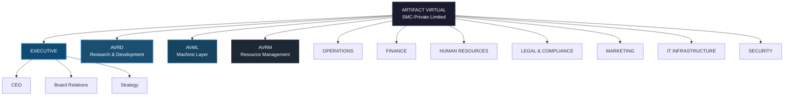

### AVRD - Research & Development Division

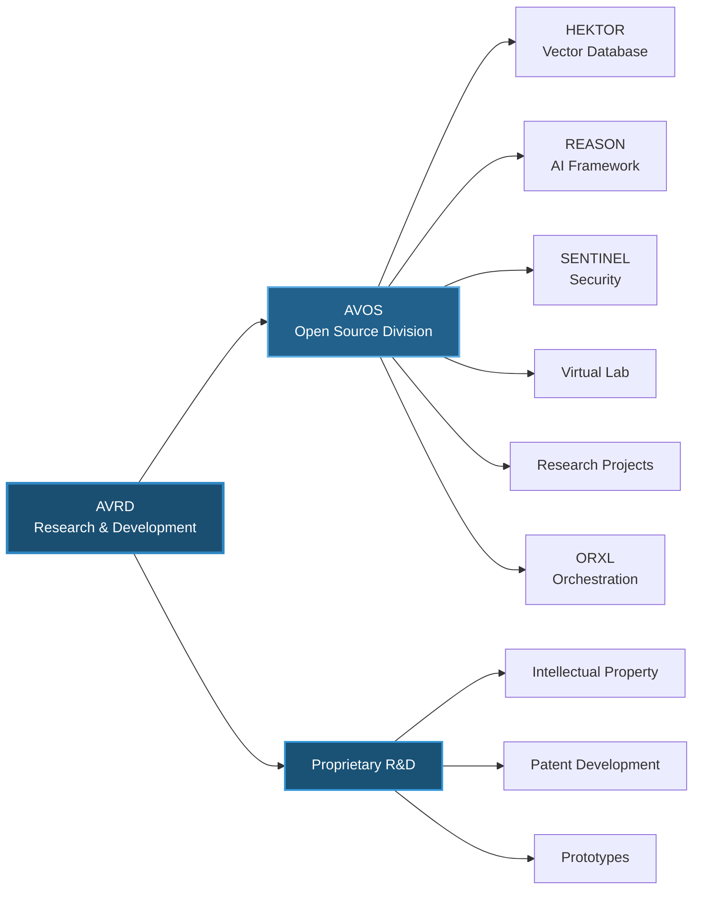

### AVML - Machine Layer Division

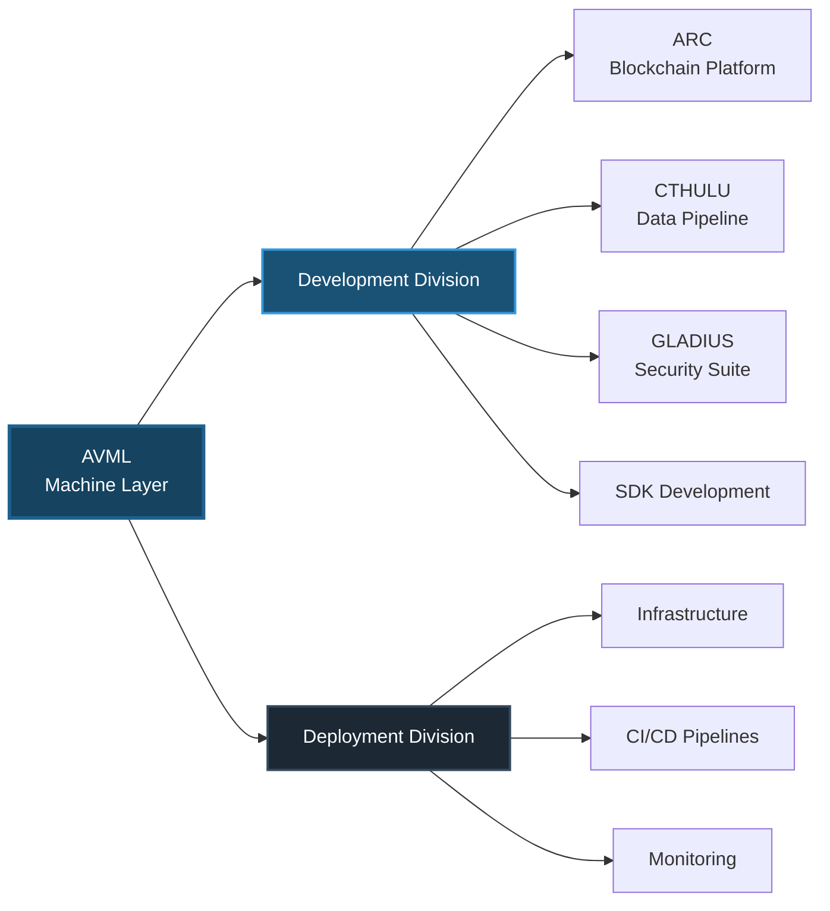

### AVRM - Resource Management Division

```mermaid
graph TB
    AVRM["AVRM
    Resource Management"]
    
    AVRM --> AI[AI & Agents Division]
    AVRM --> APPS[Applications Division]
    AVRM --> COMPUTE[Compute Division]
    AVRM --> STORAGE[Storage Division]
    AVRM --> SECURITY[Security Division]
    AVRM --> INTEGRATION[Integration Division]
    
    AI --> AVA["AVA
    Virtual Assistant"]
    AI --> AGENTS[Intelligent Agents]
    AI --> ML[Machine Learning]
    
    APPS --> ERP[Artifact ERP]
    APPS --> AVPM["AVPM
    Project Management"]
    APPS --> METEOR["METEOR
    Collaboration"]
    APPS --> DOCKIT["DOCKIT
    Documentation"]
    
    COMPUTE --> CONTAINERS[Container Orchestration]
    COMPUTE --> SERVERLESS[Serverless Functions]
    COMPUTE --> BATCH[Batch Processing]
    
    STORAGE --> DATABASE[Databases]
    STORAGE --> OBJECT[Object Storage]
    STORAGE --> CACHE[Caching Layer]
    
    SECURITY --> IAM[Identity & Access]
    SECURITY --> ENCRYPTION[Encryption Services]
    SECURITY --> AUDIT[Audit Logging]
    
    INTEGRATION --> API[API Gateway]
    INTEGRATION --> MESSAGE[Message Queue]
    INTEGRATION --> WEBHOOK[Webhooks]
    
    style AVRM fill:#1c2833,stroke:#17202a,stroke-width:3px,color:#fff
    style AI fill:#212f3c,stroke:#566573,stroke-width:2px,color:#fff
    style APPS fill:#273746,stroke:#5d6d7e,stroke-width:2px,color:#fff
    style COMPUTE fill:#2e4053,stroke:#626567,stroke-width:2px,color:#fff
```

---

## Departmental Hierarchy

### Complete Departmental Structure

```mermaid
graph TB
    ROOT[Artifact Virtual]
    
    ROOT --> D1[Executive]
    ROOT --> D2[AVRD]
    ROOT --> D3[AVML]
    ROOT --> D4[AVRM]
    ROOT --> D5[Operations]
    ROOT --> D6[Finance]
    ROOT --> D7[Human Resources]
    ROOT --> D8[Legal & Compliance]
    ROOT --> D9[Marketing]
    ROOT --> D10[IT Infrastructure]
    ROOT --> D11[Security]
    
    D1 --> D1A[CEO Office]
    D1 --> D1B[Board Relations]
    D1 --> D1C[Strategic Planning]
    D1 --> D1D[Executive Communications]
    
    D5 --> D5A[Business Operations]
    D5 --> D5B[Customer Success]
    D5 --> D5C[Quality Assurance]
    D5 --> D5D[Process Optimization]
    
    D6 --> D6A[Accounting]
    D6 --> D6B[Financial Planning]
    D6 --> D6C[Audit]
    D6 --> D6D[Procurement]
    
    D7 --> D7A[Recruitment]
    D7 --> D7B[Training & Development]
    D7 --> D7C[Compensation & Benefits]
    D7 --> D7D[Employee Relations]
    
    D8 --> D8A[Corporate Law]
    D8 --> D8B[Intellectual Property]
    D8 --> D8C[Regulatory Compliance]
    D8 --> D8D[Data Protection]
    
    D9 --> D9A[Product Marketing]
    D9 --> D9B[Digital Marketing]
    D9 --> D9C[Brand Management]
    D9 --> D9D[Market Research]
    
    D10 --> D10A[Network Infrastructure]
    D10 --> D10B[Systems Administration]
    D10 --> D10C[IT Support]
    D10 --> D10D[DevOps]
    
    D11 --> D11A[Information Security]
    D11 --> D11B[Physical Security]
    D11 --> D11C[Incident Response]
    D11 --> D11D[Security Operations]
    
    style ROOT fill:#1a1a2e,stroke:#16213e,stroke-width:4px,color:#fff
    style D1 fill:#0f4c75,stroke:#3282b8,stroke-width:2px,color:#fff
    style D2 fill:#1b4f72,stroke:#2e86c1,stroke-width:2px,color:#fff
    style D3 fill:#154360,stroke:#1f618d,stroke-width:2px,color:#fff
    style D4 fill:#1c2833,stroke:#17202a,stroke-width:2px,color:#fff
```

---

## Technical Infrastructure

### System Architecture Overview

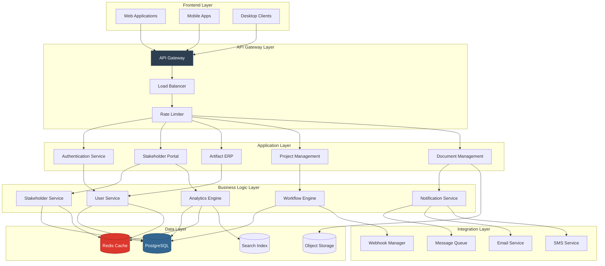

### Network Architecture

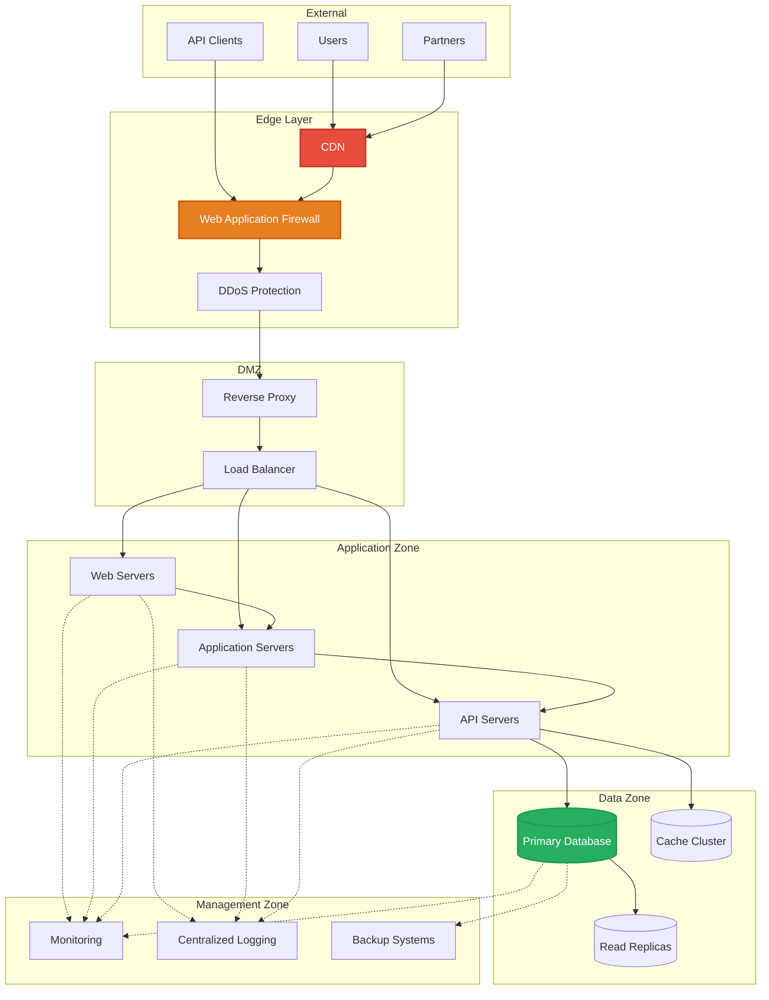

---

## Workflow Systems

### Development Workflow

```mermaid
graph LR
    subgraph "Planning"
        IDEA[Idea/Requirement]
        DESIGN[Design & Architecture]
        APPROVAL[Approval]
    end
    
    subgraph "Development"
        BRANCH[Create Branch]
        CODE[Write Code]
        TEST[Unit Tests]
        REVIEW[Code Review]
    end
    
    subgraph "Quality Assurance"
        BUILD[Build]
        INTEGRATION[Integration Tests]
        QA[QA Testing]
        SECURITY[Security Scan]
    end
    
    subgraph "Deployment"
        STAGING[Deploy to Staging]
        UAT[User Acceptance Test]
        PROD[Deploy to Production]
        MONITOR[Monitor & Verify]
    end
    
    IDEA --> DESIGN
    DESIGN --> APPROVAL
    APPROVAL --> BRANCH
    
    BRANCH --> CODE
    CODE --> TEST
    TEST --> REVIEW
    REVIEW --> BUILD
    
    BUILD --> INTEGRATION
    INTEGRATION --> QA
    QA --> SECURITY
    SECURITY --> STAGING
    
    STAGING --> UAT
    UAT --> PROD
    PROD --> MONITOR
    
    style IDEA fill:#3498db,stroke:#2980b9,stroke-width:2px,color:#fff
    style PROD fill:#27ae60,stroke:#229954,stroke-width:2px,color:#fff
    style SECURITY fill:#e74c3c,stroke:#c0392b,stroke-width:2px,color:#fff
```

### Stakeholder Engagement Workflow

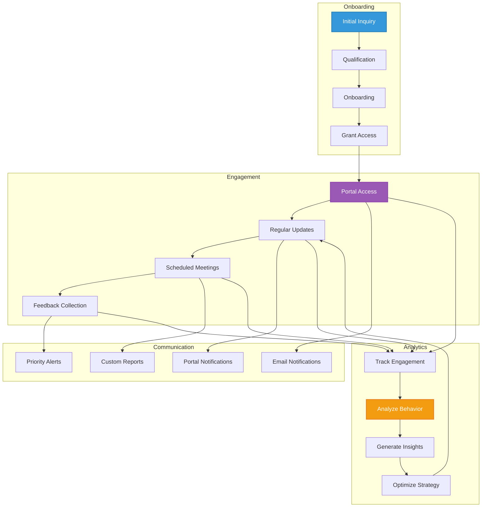

### Document Management Workflow

```mermaid
graph LR
    subgraph "Creation"
        CREATE[Create Document]
        METADATA[Add Metadata]
        CLASSIFY[Classify & Tag]
    end
    
    subgraph "Review"
        DRAFT[Draft Review]
        APPROVE[Approval Process]
        VERSION[Version Control]
    end
    
    subgraph "Distribution"
        PUBLISH[Publish]
        NOTIFY[Notify Stakeholders]
        DISTRIBUTE[Distribute Access]
    end
    
    subgraph "Management"
        ACCESS_LOG[Log Access]
        AUDIT[Audit Trail]
        ARCHIVE[Archive/Retire]
    end
    
    CREATE --> METADATA
    METADATA --> CLASSIFY
    CLASSIFY --> DRAFT
    
    DRAFT --> APPROVE
    APPROVE --> VERSION
    VERSION --> PUBLISH
    
    PUBLISH --> NOTIFY
    NOTIFY --> DISTRIBUTE
    DISTRIBUTE --> ACCESS_LOG
    
    ACCESS_LOG --> AUDIT
    AUDIT --> ARCHIVE
    
    style CREATE fill:#3498db,stroke:#2980b9,stroke-width:2px,color:#fff
    style PUBLISH fill:#27ae60,stroke:#229954,stroke-width:2px,color:#fff
    style AUDIT fill:#e74c3c,stroke:#c0392b,stroke-width:2px,color:#fff
```

---

## Data Flow Architecture

### Real-time Data Flow

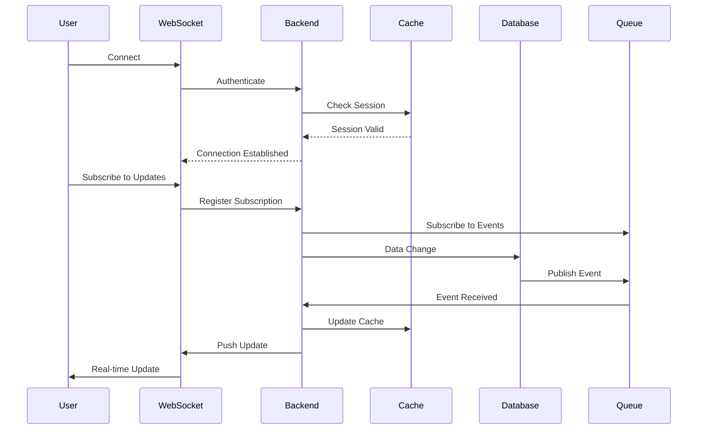

### Analytics Pipeline

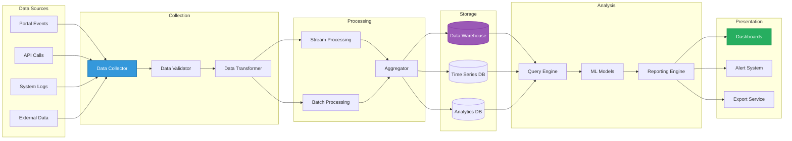

---

## Integration Map

### External Integrations

```mermaid
graph TB
    subgraph "Artifact Virtual Platform"
        CORE[Core Platform]
        API_GATE[API Gateway]
        WEBHOOK_MGR[Webhook Manager]
    end
    
    subgraph "Communication"
        EMAIL["Email Service
    SendGrid"]
        SMS["SMS Service
    Twilio"]
        SLACK[Slack Integration]
        DISCORD[Discord Integration]
    end
    
    subgraph "Development"
        GITHUB[GitHub]
        GITLAB[GitLab]
        JIRA[Jira]
        CONFLUENCE[Confluence]
    end
    
    subgraph "Analytics"
        GA[Google Analytics]
        MIXPANEL[Mixpanel]
        SEGMENT[Segment]
    end
    
    subgraph "Infrastructure"
        AWS[Amazon Web Services]
        VERCEL[Vercel]
        CLOUDFLARE[Cloudflare]
        DATADOG[Datadog]
    end
    
    subgraph "Business"
        STRIPE[Stripe Payments]
        QUICKBOOKS[QuickBooks]
        ZENDESK[Zendesk Support]
    end
    
    CORE --> API_GATE
    API_GATE --> EMAIL
    API_GATE --> SMS
    API_GATE --> SLACK
    API_GATE --> DISCORD
    
    WEBHOOK_MGR --> GITHUB
    WEBHOOK_MGR --> GITLAB
    API_GATE --> JIRA
    API_GATE --> CONFLUENCE
    
    CORE --> GA
    CORE --> MIXPANEL
    CORE --> SEGMENT
    
    CORE --> AWS
    CORE --> VERCEL
    CORE --> CLOUDFLARE
    CORE --> DATADOG
    
    API_GATE --> STRIPE
    API_GATE --> QUICKBOOKS
    API_GATE --> ZENDESK
    
    style CORE fill:#1a1a2e,stroke:#16213e,stroke-width:3px,color:#fff
    style API_GATE fill:#0f4c75,stroke:#3282b8,stroke-width:2px,color:#fff
```

### Internal System Integration

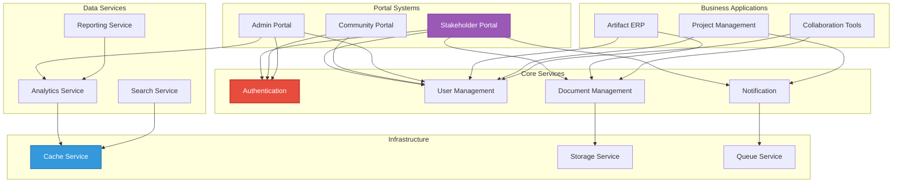

---

## Project Portfolio Structure

### Active Projects

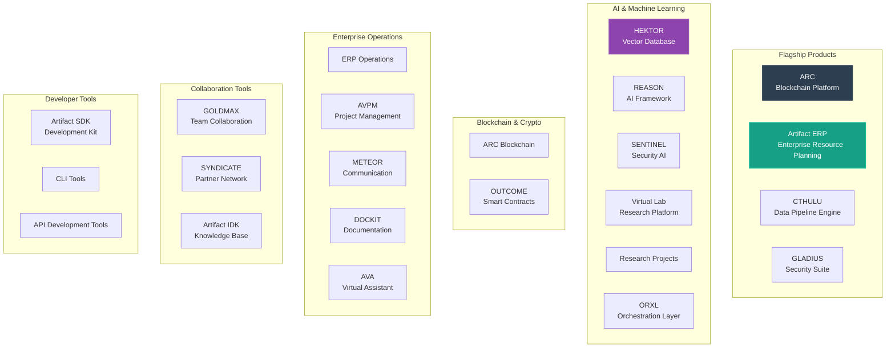

---

## Security Architecture

### Security Layers

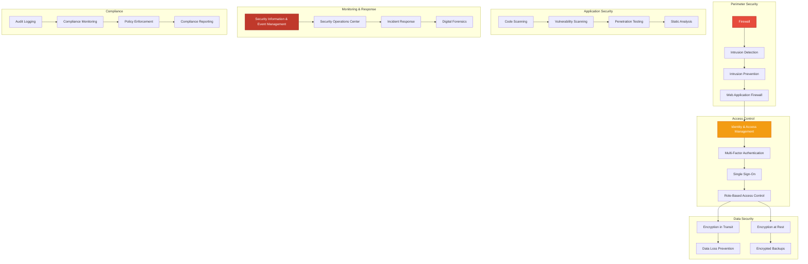

---

## Conclusion

This infrastructure map provides a comprehensive overview of Artifact Virtual's organizational structure, technical architecture, workflows, and integrations. The system is designed for:

- **Scalability**: Horizontal scaling across all layers
- **Reliability**: Redundancy and failover mechanisms
- **Security**: Multi-layered security approach
- **Integration**: Seamless connectivity between systems
- **Monitoring**: Complete observability
- **Compliance**: Audit trails and regulatory adherence

**Key Metrics:**
- 11 Core Departments
- 18 Active Projects
- 6+ Technology Divisions
- 30+ Integrated Services
- 99.9% Uptime Target

**Document Version:** 1.0.0  
**Maintenance:** Quarterly Updates  
**Owner:** Executive Team & IT Infrastructure

---

*Last Updated: 2026-02-07*  
*Status: Production Ready*
