# Artifact Virtual Infrastructure Architecture

> Complete organizational and technical structure

**Last Updated:** 2026-02-02  
**Version:** 2.0.0

---

## Infrastructure Diagram

```mermaid
graph TB
    %% Root Company
    AV[ARTIFACT VIRTUAL]
    
    %% Main Operational Wings
    AV --> AVRD[AVRD<br/>Artifact Virtual Research & Development]
    AV --> AVML[AVML<br/>Artifact Virtual Machine Layer]
    
    %% AVRD Subdivisions
    AVRD --> AVRD_OS[Open Source Division<br/>AVOS]
    AVRD --> AVRD_PROP[Proprietary Division<br/>Internal R&D]
    
    %% AVML Subdivisions
    AVML --> AVML_DEV[Development Division<br/>Research & Prototypes]
    AVML --> AVML_DEPLOY[Deployment Division<br/>Production Operations]
    
    %% Operational Methods
    AV --> OPS[Operational Infrastructure]
    OPS --> OPS_LOCAL[Local Operations<br/>Pakistan Data Center]
    OPS --> OPS_VIRTUAL[Virtual Operations<br/>US & EU Markets]
    OPS --> OPS_CLOUD[Cloud Operations<br/>Global Expansion]
    
    %% AVOS Projects
    AVRD_OS --> AVOS_LIBS[Software Libraries]
    AVRD_OS --> AVOS_TOOLS[Development Tools]
    AVRD_OS --> AVOS_FRAMEWORKS[Technical Frameworks]
    AVRD_OS --> AVOS_DOCS[Documentation & Specs]
    
    %% Proprietary Division
    AVRD_PROP --> PROP_RESEARCH[Applied Research]
    AVRD_PROP --> PROP_SYSTEMS[System Development]
    AVRD_PROP --> PROP_IP[Intellectual Property]
    
    %% Development Division
    AVML_DEV --> DEV_RESEARCH[Research Environment]
    AVML_DEV --> DEV_PROTO[Prototypes & POC]
    AVML_DEV --> DEV_EXP[Experimental Models]
    
    %% Deployment Division
    AVML_DEPLOY --> DEPLOY_PROD[Production Systems]
    AVML_DEPLOY --> DEPLOY_INFRA[Infrastructure Management]
    AVML_DEPLOY --> DEPLOY_OPS[Operational Monitoring]
    
    %% Local Operations Detail
    OPS_LOCAL --> LOCAL_DC[Data Center Islamabad]
    OPS_LOCAL --> LOCAL_COMPUTE[HPC Infrastructure]
    OPS_LOCAL --> LOCAL_ML[ML Infrastructure]
    OPS_LOCAL --> LOCAL_STORAGE[Secure Storage]
    
    %% Virtual Operations Detail
    OPS_VIRTUAL --> VIRTUAL_US[US Market Services]
    OPS_VIRTUAL --> VIRTUAL_EU[EU Market Services]
    OPS_VIRTUAL --> VIRTUAL_REMOTE[Remote R&D]
    
    %% Cloud Operations Detail
    OPS_CLOUD --> CLOUD_SCALE[Scalable Infrastructure]
    OPS_CLOUD --> CLOUD_GLOBAL[Global Distribution]
    OPS_CLOUD --> CLOUD_SERVICES[Cloud Services]
    
    %% Governance Structure
    AV --> GOV[Governance Framework]
    GOV --> GOV_BOARD[Board of Directors]
    GOV --> GOV_LEGAL[Legal Compliance]
    GOV --> GOV_POLICY[Policy & Standards]
    
    %% Legal Structure
    GOV_LEGAL --> LEGAL_MOA[Memorandum of Association]
    GOV_LEGAL --> LEGAL_AOA[Articles of Association]
    GOV_LEGAL --> LEGAL_COMP[Regulatory Compliance]
    
    %% Supporting Functions
    AV --> SUPPORT[Support Functions]
    SUPPORT --> SUPPORT_DOCS[Documentation]
    SUPPORT --> SUPPORT_SEC[Security]
    SUPPORT --> SUPPORT_QUALITY[Quality Assurance]
    
    %% Market Focus
    AV --> MARKETS[Target Markets]
    MARKETS --> MKT_PK[Pakistan Primary<br/>Islamabad Region]
    MARKETS --> MKT_US[United States<br/>Virtual Services]
    MARKETS --> MKT_EU[European Union<br/>Virtual Services]
    MARKETS --> MKT_GLOBAL[Global Cloud<br/>Expansion Phase]
    
    %% Service Offerings
    AV --> SERVICES[Service Portfolio]
    SERVICES --> SVC_DC[Data Center Services]
    SERVICES --> SVC_RD[R&D Services]
    SERVICES --> SVC_ML[ML Infrastructure]
    SERVICES --> SVC_CONSULTING[Technical Consulting]
    
    %% Technology Stack
    AV --> TECH[Technology Stack]
    TECH --> TECH_INFRA[Infrastructure Layer]
    TECH --> TECH_PLATFORM[Platform Layer]
    TECH --> TECH_APP[Application Layer]
    
    %% Infrastructure Layer
    TECH_INFRA --> INFRA_COMPUTE[Compute Resources]
    TECH_INFRA --> INFRA_NETWORK[Network Infrastructure]
    TECH_INFRA --> INFRA_STORAGE[Storage Systems]
    
    %% Platform Layer
    TECH_PLATFORM --> PLAT_OS[Operating Systems]
    TECH_PLATFORM --> PLAT_CONTAINER[Containerization]
    TECH_PLATFORM --> PLAT_ORCH[Orchestration]
    
    %% Styling
    classDef company fill:#1a237e,stroke:#0d47a1,color:#fff,stroke-width:3px
    classDef division fill:#0277bd,stroke:#01579b,color:#fff,stroke-width:2px
    classDef subdivision fill:#0288d1,stroke:#0277bd,color:#fff
    classDef operation fill:#00838f,stroke:#006064,color:#fff
    classDef service fill:#00695c,stroke:#004d40,color:#fff
    classDef support fill:#558b2f,stroke:#33691e,color:#fff
    classDef legal fill:#f57c00,stroke:#e65100,color:#fff
    classDef market fill:#6a1b9a,stroke:#4a148c,color:#fff
    
    class AV company
    class AVRD,AVML,GOV,OPS division
    class AVRD_OS,AVRD_PROP,AVML_DEV,AVML_DEPLOY subdivision
    class OPS_LOCAL,OPS_VIRTUAL,OPS_CLOUD operation
    class SERVICES,SVC_DC,SVC_RD,SVC_ML,SVC_CONSULTING service
    class SUPPORT,SUPPORT_DOCS,SUPPORT_SEC,SUPPORT_QUALITY support
    class GOV_LEGAL,LEGAL_MOA,LEGAL_AOA,LEGAL_COMP legal
    class MARKETS,MKT_PK,MKT_US,MKT_EU,MKT_GLOBAL market
```

---

## Legend

| Color | Category |
|-------|----------|
| 🟦 Dark Blue | Root Company |
| 🔵 Blue | Main Divisions |
| 🔷 Light Blue | Subdivisions |
| ● Teal | Operations |
| 🟩 Green | Services |
| 🟤 Orange | Legal/Compliance |
| 🟣 Purple | Markets |

---

## Quick Reference

### Organizational Hierarchy
- **AV** → Artifact Virtual (SMC-Private) Limited
  - **AVRD** → Research & Development
    - AVOS (Open Source)
    - Proprietary Division
  - **AVML** → Machine Layer
    - Development Division
    - Deployment Division
  - **Operations**
    - Local (Pakistan DC)
    - Virtual (US/EU)
    - Cloud (Global)

### Operational Phases
1. **Phase 1** (Months 1-18): Local Operations
2. **Phase 2** (Months 7-24): Virtual Operations
3. **Phase 3** (Months 19-36): Cloud Operations

---

*See `artifact-project.json` for complete project manifest*